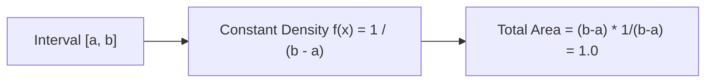

# Day 20 - Lecture 20.19: Uniform Distribution (Samaan Vantann) [Hinglish]

[](lecture_20_19.ipynb)
[](notes.pdf)

🌐 **Language / भाषा:** [English](README.md) | **हिंदी / Hinglish** | [⬅️ Lecture 20 Module Par Wapas Jayein](../README_HINGLISH.md)

---

## 1. Overview & Concept

**Continuous Uniform Distribution** $\mathcal{U}(a, b)$ me interval $[a, b]$ ke har point par aane ki sambhavna bilkul barabar (constant) hoti hai.



---

## 2. Ganitiya Sutra

### Probability Density Function (PDF):

$$
\boxed{f(x) = \frac{1}{b - a} \quad \text{for } a \le x \le b}
$$

### Mean aur Variance:

$$
\boxed{\mathbb{E}[X] = \mu = \frac{a + b}{2}}
$$

$$
\boxed{\text{Var}(X) = \sigma^2 = \frac{(b - a)^2}{12}}
$$

---

## 3. Python Implementation

```python
import numpy as np

a, b = 0.0, 10.0
vals = np.random.uniform(a, b, 1_000_000)

print(f"Mean:     {np.mean(vals):.2f} (Target: {(a+b)/2:.2f})")
print(f"Variance: {np.var(vals):.2f} (Target: {((b-a)**2)/12:.2f})")
```

---

## 4. Mukhya Batein (Key Takeaways) & Interview Points
- **Variance Formula:** Variance me denominator 12 integration ki wajah se aata hai.
- **Deep Learning Use:** Neural network ke weights initialize karne me Xavier Uniform initialization use hota hai.
