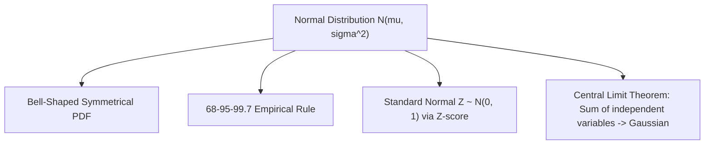

# Day 20 - Lecture 20.20: Normal Distribution

[](lecture_20_20.ipynb)
[](notes.pdf)

🌐 **Language:** **English** | [हिंदी / Hinglish](README_HINGLISH.md) | [⬅️ Back to Lecture 20 Module](../README.md)

---

## 1. Overview & Central Role in AI

The **Normal (Gaussian) Distribution** $\mathcal{N}(\mu, \sigma^2)$ is the cornerstone of probability theory, statistics, and machine learning. By the **Central Limit Theorem (CLT)**, the sum of independent random variables tends toward a Gaussian distribution, regardless of their original distributions.



---

## 2. Mathematical Formalism

### Probability Density Function (PDF):
For parameters $\mu \in \mathbb{R}$ (mean) and $\sigma > 0$ (standard deviation):

$$
\boxed{f(x) = \frac{1}{\sigma \sqrt{2\pi}} \exp\left( -\frac{(x - \mu)^2}{2\sigma^2} \right) \quad \text{for } x \in (-\infty, \infty)}
$$

### Geometry of the Bell Curve:
1. **Symmetry:** Centered and symmetric about $x = \mu$, where $\text{Mean} = \text{Median} = \text{Mode} = \mu$.
2. **Inflection Points:** The second derivative $f''(x) = 0$ occurs exactly at $x = \mu - \sigma$ and $x = \mu + \sigma$.
3. **Peak Height:** Maximum density at the mean is $f(\mu) = \frac{1}{\sigma \sqrt{2\pi}} \approx \frac{0.3989}{\sigma}$.

---

## 3. The 68-95-99.7 Empirical Rule

For any Gaussian distributed random variable $X \sim \mathcal{N}(\mu, \sigma^2)$:

$$
\boxed{P(\mu - \sigma \le X \le \mu + \sigma) \approx 0.6827 \quad (68.27\%)}
$$

$$
\boxed{P(\mu - 2\sigma \le X \le \mu + 2\sigma) \approx 0.9545 \quad (95.45\%)}
$$

$$
\boxed{P(\mu - 3\sigma \le X \le \mu + 3\sigma) \approx 0.9973 \quad (99.73\%)}
$$

---

## 4. Standard Normal Transformation ($Z$-Score)

Any Gaussian variable $X \sim \mathcal{N}(\mu, \sigma^2)$ is converted to the Standard Normal Distribution $\mathcal{Z} \sim \mathcal{N}(0, 1)$ via affine standardization:

$$
\boxed{Z = \frac{X - \mu}{\sigma}}
$$

The Standard Normal PDF simplifies to:

$$
\boxed{\phi(z) = \frac{1}{\sqrt{2\pi}} e^{-\frac{z^2}{2}}}
$$

---

## 5. Python Implementation

```python
import numpy as np
import matplotlib.pyplot as plt
from scipy.stats import norm

# Student Exam Scores: mu = 70, sigma = 10
mu = 70
sigma = 10

x = np.linspace(30, 110, 1000)
y = norm.pdf(x, mu, sigma)

# Empirical Rule Verification
p_1_sigma = norm.cdf(mu + sigma, mu, sigma) - norm.cdf(mu - sigma, mu, sigma)
p_2_sigma = norm.cdf(mu + 2*sigma, mu, sigma) - norm.cdf(mu - 2*sigma, mu, sigma)
p_3_sigma = norm.cdf(mu + 3*sigma, mu, sigma) - norm.cdf(mu - 3*sigma, mu, sigma)

print(f"Empirical Rule Integrals:")
print(f"  P(mu +- 1 sigma): {p_1_sigma * 100:.2f}% (Target: 68.27%)")
print(f"  P(mu +- 2 sigma): {p_2_sigma * 100:.2f}% (Target: 95.45%)")
print(f"  P(mu +- 3 sigma): {p_3_sigma * 100:.2f}% (Target: 99.73%)")
```

---

## 6. Key Takeaways & Interview Points
- **Z-Score Normalization:** StandardScaler in Scikit-Learn executes $Z = \frac{X - \mu}{\sigma}$ to standardize feature spaces.
- **Maximum Entropy on $(-\infty, \infty)$:** Given only a specified mean and variance, the Gaussian distribution maximizes Shannon entropy.
