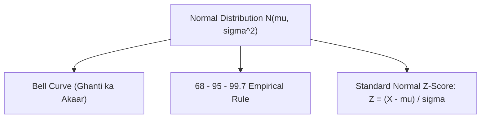

# Day 20 - Lecture 20.20: Normal (Gaussian) Distribution [Hinglish]

[](lecture_20_20.ipynb)
[](notes.pdf)

🌐 **Language / भाषा:** [English](README.md) | **हिंदी / Hinglish** | [⬅️ Lecture 20 Module Par Wapas Jayein](../README_HINGLISH.md)

---

## 1. Overview & AI me Mahatva

**Normal (Gaussian) Distribution** $\mathcal{N}(\mu, \sigma^2)$ machine learning aur statistics ka sabse mukhya pillar hai. **Central Limit Theorem (CLT)** ke anusar, chahe initial data kaisa bhi ho, independent variables ka sum hamesha Normal distribution ki taraf jata hai.



---

## 2. Ganitiya Sutra

### Probability Density Function (PDF):

$$
\boxed{f(x) = \frac{1}{\sigma \sqrt{2\pi}} \exp\left( -\frac{(x - \mu)^2}{2\sigma^2} \right)}
$$

### 68 - 95 - 99.7% Empirical Rule:

$$
\boxed{P(\mu - \sigma \le X \le \mu + \sigma) \approx 68.27\%}
$$

$$
\boxed{P(\mu - 2\sigma \le X \le \mu + 2\sigma) \approx 95.45\%}
$$

$$
\boxed{P(\mu - 3\sigma \le X \le \mu + 3\sigma) \approx 99.73\%}
$$

### Z-Score Standardization:

$$
\boxed{Z = \frac{X - \mu}{\sigma}}
$$

---

## 3. Python Implementation

```python
import numpy as np
from scipy.stats import norm

mu = 70
sigma = 10

p1 = norm.cdf(mu + sigma, mu, sigma) - norm.cdf(mu - sigma, mu, sigma)
p2 = norm.cdf(mu + 2*sigma, mu, sigma) - norm.cdf(mu - 2*sigma, mu, sigma)
p3 = norm.cdf(mu + 3*sigma, mu, sigma) - norm.cdf(mu - 3*sigma, mu, sigma)

print(f"68% Rule: {p1*100:.2f}%")
print(f"95% Rule: {p2*100:.2f}%")
print(f"99.7% Rule: {p3*100:.2f}%")
```

---

## 4. Mukhya Batein (Key Takeaways) & Interview Points
- **StandardScaler:** Machine learning me features ko scale karne ke liye StandardScaler isi $Z = \frac{X - \mu}{\sigma}$ formula ka use karta hai.
- **Bell Curve:** $\mu$ par center hota hai aur $\mu \pm \sigma$ par curve apna inflection point badalta hai.
