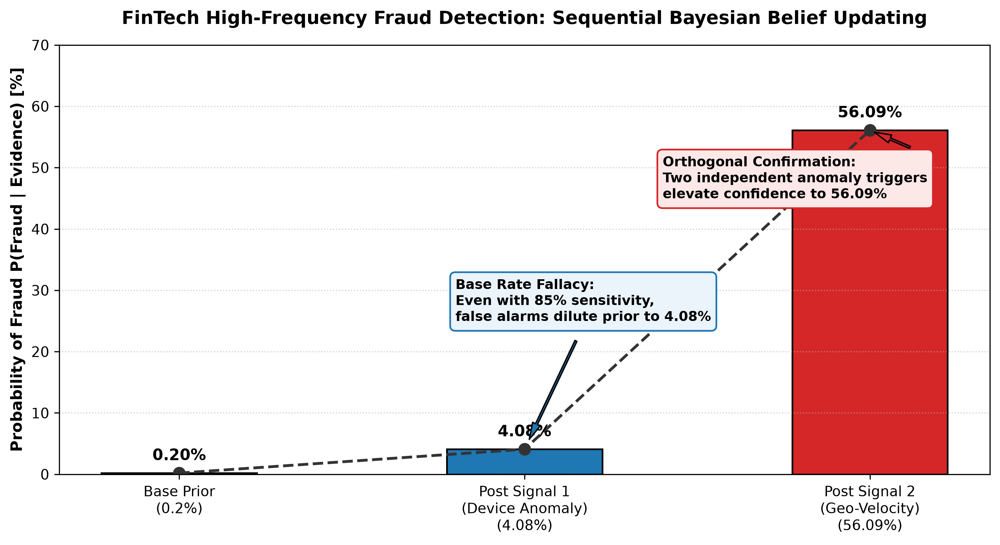
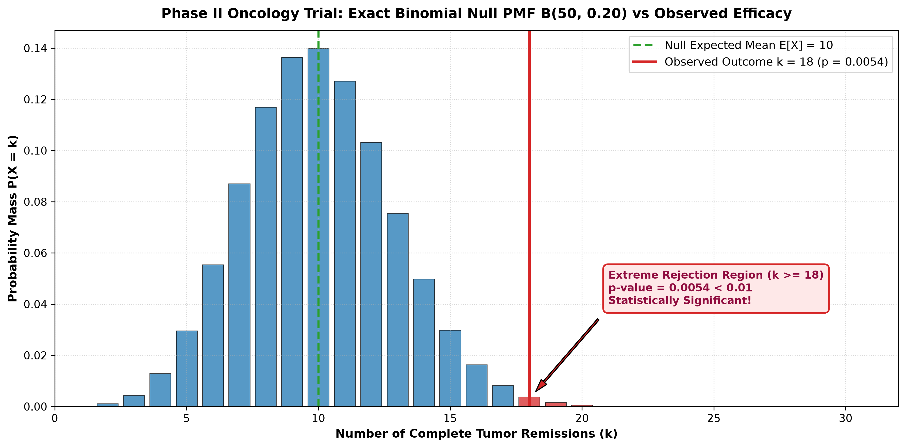
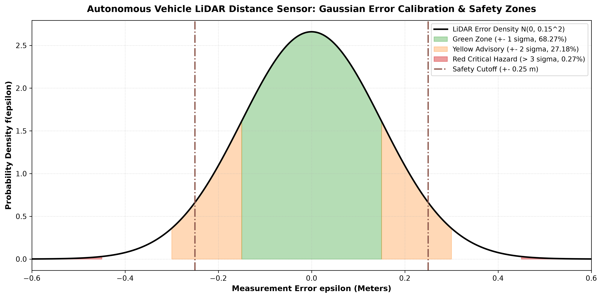

# 💡 Lecture 20: Practice Problems — Comprehensive Solutions Guide

[](solutions.ipynb)
[](solutions.pdf)
[](../Questions/README.md)
[](case1_bayesian_fraud_updates.png)
[](case2_binomial_efficacy_test.png)
[](case3_gaussian_sensor_calibration.png)

🌐 **Language:** **English** | [हिंदी / Hinglish](README_HINGLISH.md) | [⬅️ Back to Questions](../Questions/README.md) | [📁 Practice Problems Overview](../README.md)

---

## 📌 Executive Architecture & Engineering Standards

This document provides production-grade reference solutions, formal mathematical proofs, and executive visual engineering implementations for the 3 industry case studies in **Lecture 20**.

---

# 📌 Solution to Case 1: High-Frequency FinTech Bayesian Fraud & Anomaly Detection Pipeline

### 1. Mathematical Derivations & Proofs

Let $F$ denote the event that a transaction is Fraudulent, and $L = F'$ denote Legitimate.
Prior base rate: $P(F) = 0.002 \implies P(L) = 0.998$.

#### Step 1: Single-Signal Bayesian Update ($S_1$)
Marginal probability of Signal 1 triggering (Law of Total Probability):

$$
\boxed{P(S_1) = P(S_1 \mid F) P(F) + P(S_1 \mid L) P(L)}
$$

$$
P(S_1) = (0.85 \cdot 0.002) + (0.04 \cdot 0.998) = 0.00170 + 0.03992 = 0.04162 \quad (4.162\%)
$$

Applying Bayes' Theorem:

$$
\boxed{P(F \mid S_1) = \frac{P(S_1 \mid F) P(F)}{P(S_1)} = \frac{0.00170}{0.04162} \approx 0.040846 \quad (4.08\%)}
$$

#### The Base Rate Fallacy Explained:
Even though Signal 1 has an $85\%$ true positive detection rate, observing $S_1$ only elevates the probability of fraud from $0.2\%$ to $\approx 4.08\%$. Because $99.8\%$ of transactions are legitimate, the $4\%$ false positive rate produces $399$ false alarms for every $17$ true frauds!

---

#### Step 2: Sequential Bayesian Update ($S_2$)
Now, incorporating Signal 2, the prior belief is the posterior from Step 1:

$$
\pi_1(F) = P(F \mid S_1) \approx 0.040846, \qquad \pi_1(L) = 1 - \pi_1(F) \approx 0.959154
$$

Marginal evidence for Signal 2 under the updated prior:

$$
P(S_2 \mid S_1) = P(S_2 \mid F) \pi_1(F) + P(S_2 \mid L) \pi_1(L)
$$

$$
P(S_2 \mid S_1) = (0.90 \cdot 0.040846) + (0.03 \cdot 0.959154) = 0.036761 + 0.028775 = 0.065536
$$

Updated posterior after both signals trigger:

$$
\boxed{P(F \mid S_1, S_2) = \frac{P(S_2 \mid F) \pi_1(F)}{P(S_2 \mid S_1)} = \frac{0.036761}{0.065536} \approx 0.5609 \quad (56.09\%)}
$$

After two independent positive anomaly detections, the confidence of fraud jumps from $0.2\% \to 4.08\% \to \mathbf{56.09\%}$!

---

#### Step 3: Proof of Equivalence (Sequential vs. Simultaneous)
Under conditional independence $P(S_1, S_2 \mid F) = P(S_1 \mid F) P(S_2 \mid F)$:

$$
P(F \mid S_1, S_2) = \frac{P(S_1 \mid F) P(S_2 \mid F) P(F)}{P(S_1 \mid F) P(S_2 \mid F) P(F) + P(S_1 \mid L) P(S_2 \mid L) P(L)}
$$

Numerator: $0.85 \cdot 0.90 \cdot 0.002 = 0.00153$.
Denominator: $0.00153 + (0.04 \cdot 0.03 \cdot 0.998) = 0.00153 + 0.0011976 = 0.0027276$.

$$
\boxed{\frac{0.00153}{0.0027276} \approx 0.5609 \quad (\text{Q.E.D.})}
$$

---

### 2. Complete Python Implementation & Visualization

```python
import numpy as np
import matplotlib.pyplot as plt

# FinTech System Parameters
p_prior = 0.002
sens_s1, fpr_s1 = 0.85, 0.04
sens_s2, fpr_s2 = 0.90, 0.03

# 1. Step 1 Update
p_s1 = sens_s1 * p_prior + fpr_s1 * (1 - p_prior)
post_s1 = (sens_s1 * p_prior) / p_s1

# 2. Step 2 Update (Sequential)
p_s2 = sens_s2 * post_s1 + fpr_s2 * (1 - post_s1)
post_s2 = (sens_s2 * post_s1) / p_s2

# 3. Simultaneous Joint Check
num_joint = sens_s1 * sens_s2 * p_prior
den_joint = num_joint + fpr_s1 * fpr_s2 * (1 - p_prior)
post_joint = num_joint / den_joint

print(f"Prior Base Rate:              {p_prior * 100:.2f}%")
print(f"Posterior after Signal 1:     {post_s1 * 100:.2f}%")
print(f"Posterior after Signal 2:     {post_s2 * 100:.2f}%")
print(f"Simultaneous Joint Posterior: {post_joint * 100:.2f}%")
```

#### 📊 Generated High-Resolution Visualization:


---

# 📌 Solution to Case 2: Bioinformatics Clinical Drug Efficacy via Binomial Testing

### 1. Mathematical Derivations & Statistical Testing

- Sample size: $n = 50$
- Null historical efficacy: $p_0 = 0.20$
- Observed remissions: $k = 18$

#### Step 1: Formal Statistical Hypotheses:

$$
\boxed{H_0: p \le 0.20 \quad \text{(Compound is no better than standard of care)}}
$$

$$
\boxed{H_1: p > 0.20 \quad \text{(Compound possesses superior therapeutic efficacy)}}
$$

#### Step 2: Exact Binomial p-Value Derivation
Under $H_0$, the random variable $X$ follows $B(50, 0.20)$:

$$
\boxed{p\text{-value} = P(X \ge 18) = 1 - P(X \le 17) = 1 - \sum_{j=0}^{17} \binom{50}{j} (0.20)^j (0.80)^{50-j}}
$$

Using the binomial survival function:

$$
\boxed{p\text{-value} \approx 0.005398 \quad (0.54\%)}
$$

#### Step 3: Gaussian Approximation with Yates Continuity Correction
Under the Central Limit Theorem:
- Expected Mean: $\mu = np_0 = 50 \cdot 0.20 = 10.0$
- Variance: $\sigma^2 = np_0(1 - p_0) = 50 \cdot 0.20 \cdot 0.80 = 8.0$
- Standard Deviation: $\sigma = \sqrt{8.0} \approx 2.8284$

Applying continuity correction ($k - 0.5 = 17.5$):

$$
\boxed{Z = \frac{17.5 - 10.0}{\sqrt{8.0}} = \frac{7.5}{2.8284} \approx 2.6516}
$$

Gaussian upper-tail probability:

$$
\boxed{P(Z \ge 2.6516) = 1 - \Phi(2.6516) \approx 0.004005 \quad (0.40\%)}
$$

#### Step 4: Regulatory Decision
At significance level $\alpha = 0.01$ (99% confidence):

$$
p\text{-value} = 0.005398 < \alpha = 0.01
$$

**Verdict:** Reject the null hypothesis $H_0$. The drug demonstrates statistically significant clinical superiority at the $99\%$ confidence level ($p < 0.01$). Phase III trials are fully justified.

---

### 2. Complete Python Implementation & Visualization

```python
import numpy as np
from scipy.stats import binom, norm

n = 50
p0 = 0.20
k_obs = 18

# 1. Exact Binomial p-value
p_val_exact = binom.sf(k_obs - 1, n, p0)

# 2. Gaussian Approximation
mu = n * p0
sigma = np.sqrt(n * p0 * (1 - p0))
z_score = (k_obs - 0.5 - mu) / sigma
p_val_gauss = norm.sf(z_score)

print(f"Exact Binomial p-value:  {p_val_exact:.6f}")
print(f"Gaussian Approx Z-score: {z_score:.4f}")
print(f"Gaussian Approx p-value: {p_val_gauss:.6f}")
print(f"Statistically Significant at alpha=0.01: {p_val_exact < 0.01}")
```

#### 📊 Generated High-Resolution Visualization:


---

# 📌 Solution to Case 3: Autonomous Vehicle LiDAR Sensor Calibration & Gaussian Noise Normalization

### 1. Mathematical Formulation & Normal Integration

Noise model: $\epsilon \sim \mathcal{N}(0, \sigma^2)$ with $\sigma = 0.15\text{ m}$.

#### Step 1: Operational Safety Zones (Empirical Rule):
1. **Green Zone ($|\epsilon| \le 0.15\text{ m} = 1\sigma$):**

$$
\boxed{P(-1\sigma \le \epsilon \le 1\sigma) = \Phi(1) - \Phi(-1) \approx 0.6827 \quad (68.27\%)}
$$

2. **Yellow Advisory Zone ($0.15\text{ m} < |\epsilon| \le 0.30\text{ m}$):**

$$
\boxed{P(1\sigma < |\epsilon| \le 2\sigma) = (\Phi(2) - \Phi(-2)) - (\Phi(1) - \Phi(-1)) = 0.9545 - 0.6827 = 0.2718 \quad (27.18\%)}
$$

3. **Red Critical Hazard Zone ($|\epsilon| > 0.45\text{ m} = 3\sigma$):**

$$
\boxed{P(|\epsilon| > 3\sigma) = 2 \cdot (1 - \Phi(3)) \approx 0.0027 \quad (0.27\%)}
$$

#### Step 2: Exact Safety Cutoff ($|\epsilon| > 0.25\text{ m}$):
Standardized Z-cutoff: $Z = \frac{0.25}{0.15} = \frac{5}{3} \approx 1.6667$.

$$
\boxed{P(|\epsilon| > 0.25) = 2 \cdot (1 - \Phi(1.6667)) = 2 \cdot (1 - 0.95221) = 0.09558 \quad (9.56\%)}
$$

---

### 2. Complete Python Implementation & Visualization

```python
import numpy as np
from scipy.stats import norm

sigma = 0.15
cutoff = 0.25

p_green = norm.cdf(1) - norm.cdf(-1)
p_yellow = (norm.cdf(2) - norm.cdf(-2)) - p_green
p_red = 2 * norm.sf(3)
p_cutoff = 2 * norm.sf(cutoff / sigma)

print(f"Green Zone (1-sigma):  {p_green * 100:.2f}%")
print(f"Yellow Zone (2-sigma): {p_yellow * 100:.2f}%")
print(f"Red Zone (3-sigma):    {p_red * 100:.2f}%")
print(f"P(|error| > 0.25 m):   {p_cutoff * 100:.2f}%")
```

#### 📊 Generated High-Resolution Visualization:

