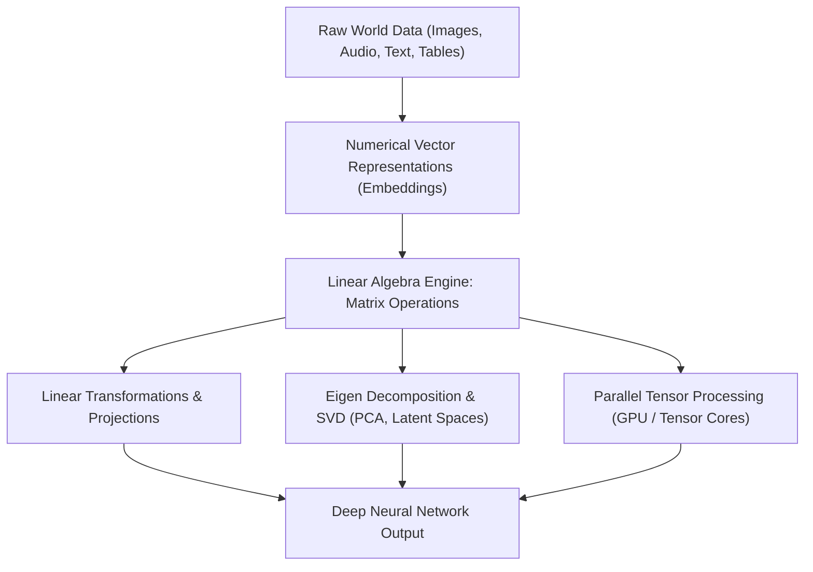

# Day 21 - Lecture 21.1: Introduction to Linear Algebra for AI & ML

[](https://www.python.org/)
[](lecture_21_01.ipynb)
[](notes.pdf)

🌐 **Language:** **English** | [हिंदी / Hinglish](README_HINGLISH.md) | [⬅️ Back to Lecture 21 Module](../README.md)

---

## 1. Overview & Computational Architecture

**Linear Algebra** is the operational language of modern Artificial Intelligence, Machine Learning, and High-Performance Computing. Virtually every foundational algorithm—from Ordinary Least Squares linear regression to 175-billion parameter Large Language Models (LLMs)—is fundamentally expressed as matrix and vector transformations executed massively in parallel across GPUs and TPUs.



### Why Linear Algebra Powers AI:
1. **Data Representation:** An image is a 3D tensor $\mathbf{X} \in \mathbb{R}^{H \times W \times C}$; a token embedding is a vector $\mathbf{v} \in \mathbb{R}^{D}$; a tabular dataset is an $N \times D$ design matrix.
2. **Computational Parallelism:** Dense matrix multiplication ($\mathbf{C} = \mathbf{A}\mathbf{B}$) exhibits intense spatial locality, allowing GPU systolic arrays to execute trillions of multiply-accumulate (MAC) operations per second.
3. **Linear Transformations:** Neural network layers perform affine mappings $\mathbf{y} = \sigma(\mathbf{W}\mathbf{x} + \mathbf{b})$, projecting high-dimensional input manifolds into feature spaces where classes become linearly separable.

---

## 2. Mathematical Formalism: Vector Spaces and Tensors

A **Vector Space** $\mathcal{V}$ over field $\mathbb{R}$ is a set of mathematical objects endowed with two closed operations: vector addition and scalar multiplication.

### The Tensor Hierarchy in Machine Learning:

$$
\boxed{\text{Scalar: } s \in \mathbb{R} \quad (\text{Order } 0)}
$$

$$
\boxed{\text{Vector: } \mathbf{v} = \begin{bmatrix} v_1 \\ v_2 \\ \vdots \\ v_n \end{bmatrix} \in \mathbb{R}^n \quad (\text{Order } 1)}
$$

$$
\boxed{\text{Matrix: } \mathbf{A} = \begin{bmatrix} a_{11} & a_{12} & \dots & a_{1n} \\ a_{21} & a_{22} & \dots & a_{2n} \\ \vdots & \vdots & \ddots & \vdots \\ a_{m1} & a_{m2} & \dots & a_{mn} \end{bmatrix} \in \mathbb{R}^{m \times n} \quad (\text{Order } 2)}
$$

$$
\boxed{\text{Tensor: } \boldsymbol{\mathcal{T}} \in \mathbb{R}^{d_1 \times d_2 \times \dots \times d_k} \quad (\text{Order } k)}
$$

---

## 3. Python Implementation: Tensor Representation in NumPy

```python
import numpy as np

# 1. Scalar (0D Tensor)
scalar = np.array(42)

# 2. Vector (1D Tensor): Feature embedding of a word
vector = np.array([0.25, -1.40, 0.85, 3.12])

# 3. Matrix (2D Tensor): Batch of 3 patient health records (Age, BP, Cholesterol)
matrix = np.array([
    [45, 120, 210],
    [52, 135, 240],
    [31, 110, 180]
])

# 4. 3D Tensor: Batch of image color channels (Batch x Height x Width)
tensor_3d = np.random.randn(2, 4, 4)

print(f"Scalar rank: {scalar.ndim}, shape: {scalar.shape}")
print(f"Vector rank: {vector.ndim}, shape: {vector.shape}")
print(f"Matrix rank: {matrix.ndim}, shape: {matrix.shape}")
print(f"Tensor rank: {tensor_3d.ndim}, shape: {tensor_3d.shape}")
```

---

## 4. Key Takeaways & Interview Points
- **Linearity in AI:** Real-world phenomena are non-linear, but deep neural networks approximate non-linear manifolds using alternating stacks of **linear matrix transformations** and non-linear activations.
- **Hardware Acceleration:** GPUs are specialized hardware engines built exclusively for dense linear algebra computations (BLAS Level 3 operations).
