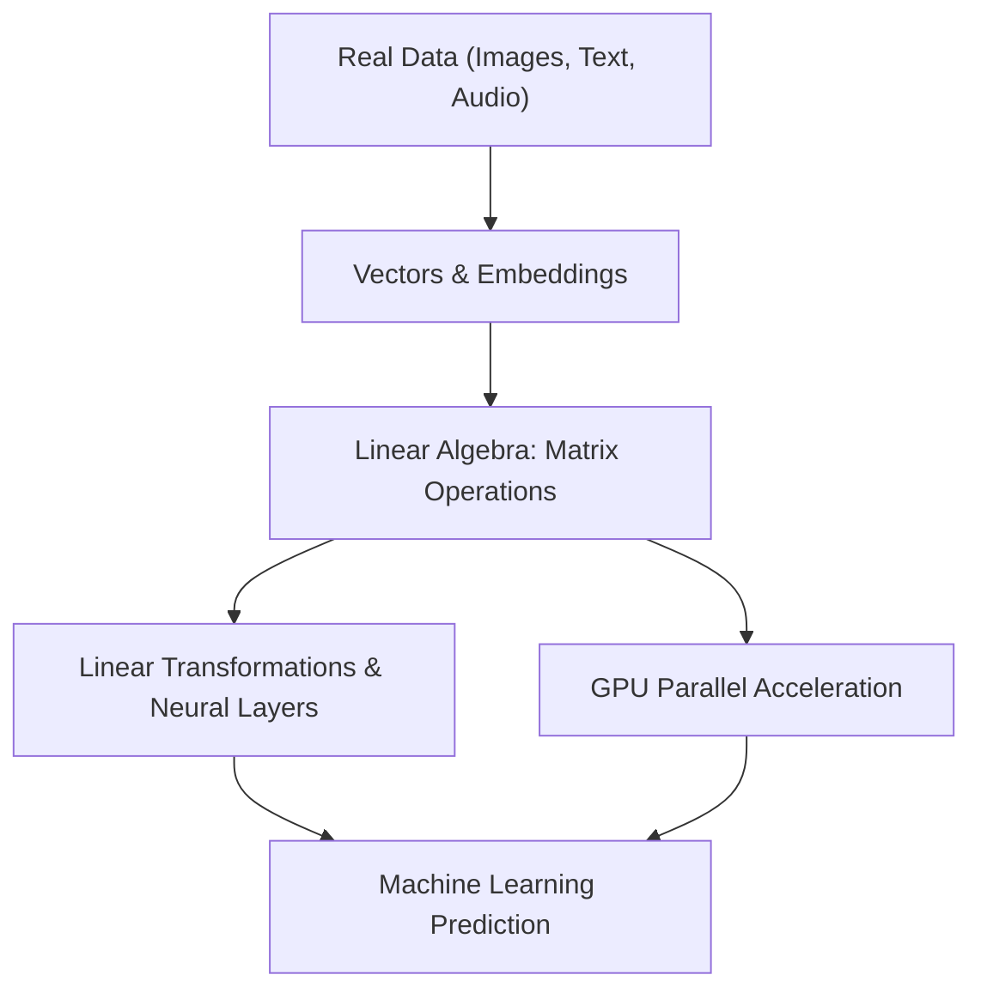

# Day 21 - Lecture 21.1: Linear Algebra ka Parichay (Introduction for AI & ML) [Hinglish]

[](https://www.python.org/)
[](lecture_21_01.ipynb)
[](notes.pdf)

🌐 **Language / भाषा:** [English](README.md) | **हिंदी / Hinglish** | [⬅️ Lecture 21 Module Par Wapas Jayein](../README_HINGLISH.md)

---

## 1. Overview & AI me Linear Algebra ka Role

**Linear Algebra** Artificial Intelligence, Machine Learning aur Deep Learning ki buniyaad (backbone) hai. Data science me har cheez—chahe woh photo ho, text ho, voice ho ya tabular data—aakhir me numbers ke vectors aur matrices me convert hoti hai.



### Linear Algebra kyu anivarya hai?
1. **Data Representation:** Ek image pixel values ka 3D matrix (Tensor) hoti hai; text token ek vector embedding hota hai; pura dataset ek $N \times D$ matrix hota hai.
2. **GPU Parallelism:** Neural networks me Matrix Multiplication ($\mathbf{W}\mathbf{x} + \mathbf{b}$) hota hai, jise GPUs par parallelly calculate kiya jata hai.
3. **Space Transformations:** High-dimensional data ko rotate, scale aur project karke patterns dhoondhna Linear Algebra ke bina sambhav nahi hai.

---

## 2. Ganitiya Roop: Scalars, Vectors, Matrices aur Tensors

$$
\boxed{\text{Scalar: } s \in \mathbb{R} \quad (\text{Rank } 0)}
$$

$$
\boxed{\text{Vector: } \mathbf{v} \in \mathbb{R}^n \quad (\text{Rank } 1)}
$$

$$
\boxed{\text{Matrix: } \mathbf{A} \in \mathbb{R}^{m \times n} \quad (\text{Rank } 2)}
$$

$$
\boxed{\text{Tensor: } \boldsymbol{\mathcal{T}} \in \mathbb{R}^{d_1 \times \dots \times d_k} \quad (\text{Rank } k)}
$$

---

## 3. Python Implementation

```python
import numpy as np

# Scalar
s = np.array(10)

# Vector (1D)
v = np.array([1.5, 2.0, -3.5])

# Matrix (2D)
M = np.array([[1, 2], [3, 4]])

print(f"Vector Shape: {v.shape}, Matrix Shape: {M.shape}")
```

---

## 4. Mukhya Batein (Key Takeaways) & Interview Points
- **AI ki Bhasha:** Machine Learning models data ko numbers ke vectors ke roop me dekhte hain.
- **Deep Learning Layers:** Har Dense layer $\mathbf{y} = \sigma(\mathbf{W}\mathbf{x} + \mathbf{b})$ ek affine linear transformation perform karti hai.
