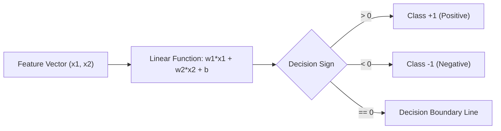

# Day 21 - Lecture 21.2: Straight Lines & Linear Equations

[](https://www.python.org/)
[](lecture_21_02.ipynb)
[](notes.pdf)

🌐 **Language:** **English** | [हिंदी / Hinglish](README_HINGLISH.md) | [⬅️ Back to Lecture 21 Module](../README.md)

---

## 1. Overview & Linear Decision Boundaries

In Cartesian 2D coordinate space, a **straight line** is the geometric locus of points satisfying a linear polynomial equation of degree 1. In Machine Learning, a straight line serves as the fundamental **linear decision boundary** that separates two classification classes in a 2D feature space.



---

## 2. Mathematical Formalism

### 1. Slope-Intercept Form:
For non-vertical lines with slope $m$ and vertical intercept $c$:

$$
\boxed{y = mx + c}
$$

where the slope $m = \tan(\theta) = \frac{y_2 - y_1}{x_2 - x_1}$ measures the rate of vertical change per unit horizontal displacement.

### 2. General Standard Form:

$$
\boxed{ax + by + c = 0}
$$

Converting between forms:

$$
y = -\frac{a}{b}x - \frac{c}{b} \implies m = -\frac{a}{b}, \quad \text{Intercept} = -\frac{c}{b} \quad (b \ne 0)
$$

### 3. Hyperplane Representation in Machine Learning:
In machine learning vector notation, let feature vector $\mathbf{x} = [x_1, x_2]^T$, weight vector $\mathbf{w} = [w_1, w_2]^T$, and bias $b$:

$$
\boxed{\mathbf{w}^T \mathbf{x} + b = w_1 x_1 + w_2 x_2 + b = 0}
$$

- The weight vector $\mathbf{w}$ is strictly **perpendicular (normal)** to the straight line boundary.
- The bias $b$ controls the perpendicular offset of the line from the origin.

---

## 3. Python Implementation: Plotting Linear Decision Boundary

```python
import numpy as np
import matplotlib.pyplot as plt

# Linear equation parameters: w1*x1 + w2*x2 + b = 0 -> 2*x1 - 3*x2 + 6 = 0
w1, w2, b = 2.0, -3.0, 6.0

# Generate x1 values
x1 = np.linspace(-5, 5, 200)
# Solve for x2: x2 = -(w1*x1 + b) / w2
x2 = -(w1 * x1 + b) / w2

slope = -w1 / w2
intercept = -b / w2

print(f"Line Equation: {w1}*x1 + ({w2})*x2 + {b} = 0")
print(f"Slope m:       {slope:.4f}")
print(f"Intercept c:   {intercept:.4f}")
```

---

## 4. Key Takeaways & Interview Points
- **Geometric Meaning of Weights:** The weights $w_1, w_2$ determine the orientation (tilt) of the decision boundary, while the weight vector $\mathbf{w}$ points directly in the direction of the positive class.
- **Generalization to High Dimensions:** A straight line in $\mathbb{R}^2$ generalizes to a plane in $\mathbb{R}^3$, and a **hyperplane** in $\mathbb{R}^D$.
