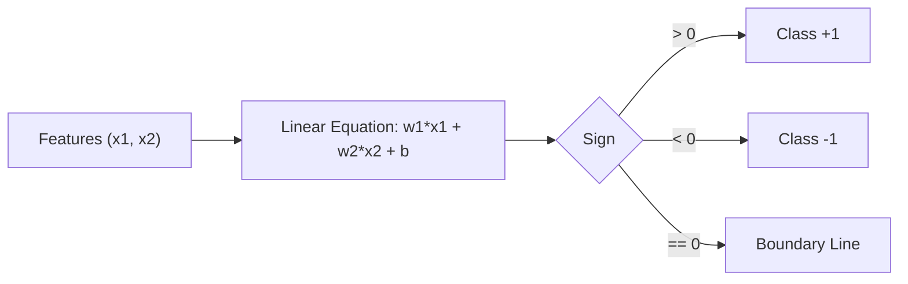

# Day 21 - Lecture 21.2: Seedhi Rekhayein aur Linear Equations (Straight Lines) [Hinglish]

[](https://www.python.org/)
[](lecture_21_02.ipynb)
[](notes.pdf)

🌐 **Language / भाषा:** [English](README.md) | **हिंदी / Hinglish** | [⬅️ Lecture 21 Module Par Wapas Jayein](../README_HINGLISH.md)

---

## 1. Overview & Machine Learning Boundary

2D Cartesian plane me ek **Straight Line** degree 1 ki linear equation hoti hai. Machine Learning me yeh do classes ke beech **Decision Boundary** banati hai jo data ko separate karti hai.



---

## 2. Ganitiya Sutra

### Slope-Intercept Form:

$$
\boxed{y = mx + c}
$$

jahan slope $m = \frac{y_2 - y_1}{x_2 - x_1}$ aur $c$ y-intercept hota hai.

### General Form:

$$
\boxed{ax + by + c = 0}
$$

### Machine Learning Hyperplane Notation:

$$
\boxed{\mathbf{w}^T \mathbf{x} + b = w_1 x_1 + w_2 x_2 + b = 0}
$$

- Weight vector $\mathbf{w} = [w_1, w_2]^T$ line ke hamesha **perpendicular (normal)** hota hai.
- Bias $b$ yeh tay karta hai ki line origin se kitni door hai.

---

## 3. Python Implementation

```python
import numpy as np

# Line: 2*x1 - 3*x2 + 6 = 0
w1, w2, b = 2.0, -3.0, 6.0
m = -w1 / w2
c = -b / w2

print(f"Slope m: {m:.2f}, Intercept c: {c:.2f}")
```

---

## 4. Mukhya Batein (Key Takeaways) & Interview Points
- **Perceptron Boundary:** Perceptron aur Logistic Regression ka decision boundary yahi line $\mathbf{w}^T \mathbf{x} + b = 0$ hoti hai.
- **Normal Vector:** Weight vector $\mathbf{w}$ decision surface ke 90 degree par point karta hai.
