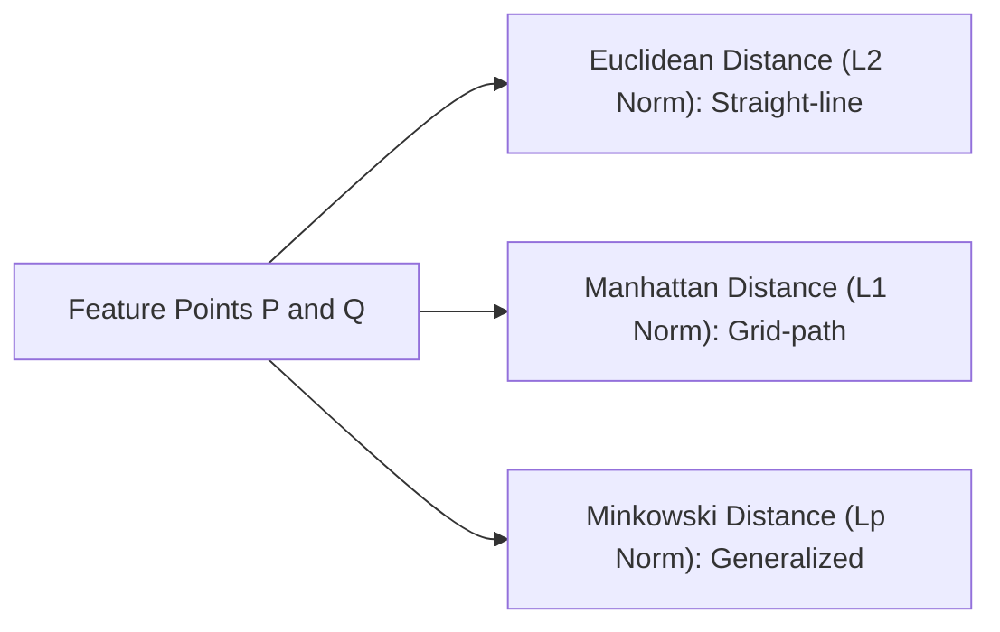

# Day 21 - Lecture 21.3: Distance Between Two Points

[](https://www.python.org/)
[](lecture_21_03.ipynb)
[](notes.pdf)

🌐 **Language:** **English** | [हिंदी / Hinglish](README_HINGLISH.md) | [⬅️ Back to Lecture 21 Module](../README.md)

---

## 1. Overview & Distance Metrics in Machine Learning

Calculating the geometric distance between two coordinate points is the bedrock of distance-based machine learning algorithms, including **K-Nearest Neighbors (KNN)**, **K-Means Clustering**, hierarchical clustering, and spatial anomaly detection.



---

## 2. Mathematical Formalism

### 1. Euclidean Distance ($L_2$ Norm):
In 2D Cartesian space between points $P(x_1, y_1)$ and $Q(x_2, y_2)$, derived directly from the Pythagorean theorem:

$$
\boxed{d_{\text{Euclid}}(P, Q) = \sqrt{(x_2 - x_1)^2 + (y_2 - y_1)^2}}
$$

In $n$-dimensional Euclidean space $\mathbb{R}^n$ between vectors $\mathbf{p}, \mathbf{q} \in \mathbb{R}^n$:

$$
\boxed{\|\mathbf{p} - \mathbf{q}\|_2 = \sqrt{\sum_{i=1}^n (p_i - q_i)^2} = \sqrt{(\mathbf{p} - \mathbf{q})^T (\mathbf{p} - \mathbf{q})}}
$$

### 2. Manhattan Distance ($L_1$ Norm / Taxicab Distance):

$$
\boxed{d_{\text{Manhattan}}(\mathbf{p}, \mathbf{q}) = \|\mathbf{p} - \mathbf{q}\|_1 = \sum_{i=1}^n |p_i - q_i|}
$$

### 3. General Minkowski Distance ($L_p$ Metric):

$$
\boxed{D_p(\mathbf{p}, \mathbf{q}) = \left( \sum_{i=1}^n |p_i - q_i|^p \right)^{1/p}}
$$

---

## 3. Python Implementation

```python
import numpy as np

# Two feature vectors in 4D space
p = np.array([2.0, 3.5, -1.0, 4.0])
q = np.array([5.0, 1.0, 2.0, 0.0])

# 1. Euclidean Distance (L2)
d_l2 = np.linalg.norm(p - q, ord=2)

# 2. Manhattan Distance (L1)
d_l1 = np.linalg.norm(p - q, ord=1)

# 3. Manual vector formulation
diff = p - q
d_manual = np.sqrt(np.dot(diff, diff))

print(f"Point P: {p}")
print(f"Point Q: {q}")
print(f"Euclidean Distance (L2): {d_l2:.4f}")
print(f"Manhattan Distance (L1): {d_l1:.4f}")
print(f"Manual Dot Check Match:  {np.isclose(d_l2, d_manual)}")
```

---

## 4. Key Takeaways & Interview Points
- **Curse of Dimensionality:** In extremely high-dimensional spaces ($D > 1000$), Euclidean distances between points converge to nearly identical values, degrading KNN accuracy. Manhattan distance ($L_1$) often performs better in high dimensions.
- **Vectorized Dot Product:** In code, never use loops to compute distance; compute $\sqrt{(\mathbf{p}-\mathbf{q}) \cdot (\mathbf{p}-\mathbf{q})}$ via vectorized BLAS operations.
