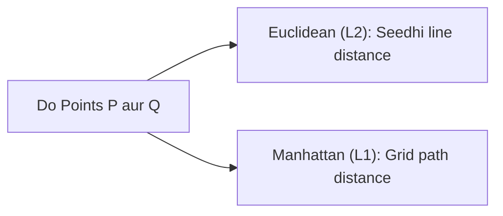

# Day 21 - Lecture 21.3: Do Binduon ke Beech ki Doori (Distance Between 2 Points) [Hinglish]

[](https://www.python.org/)
[](lecture_21_03.ipynb)
[](notes.pdf)

🌐 **Language / भाषा:** [English](README.md) | **हिंदी / Hinglish** | [⬅️ Lecture 21 Module Par Wapas Jayein](../README_HINGLISH.md)

---

## 1. Overview & Machine Learning me Use

Data points ke beech ki geometric doori (distance) calculate karna **K-Nearest Neighbors (KNN)** aur **K-Means Clustering** jaise algorithms ka sabse mukhya step hota hai.



---

## 2. Ganitiya Sutra

### Euclidean Distance ($L_2$ Norm):
Pythagoras theorem se 2D space me:

$$
\boxed{d = \sqrt{(x_2 - x_1)^2 + (y_2 - y_1)^2}}
$$

$n$-dimensional feature space $\mathbb{R}^n$ me:

$$
\boxed{\|\mathbf{p} - \mathbf{q}\|_2 = \sqrt{\sum_{i=1}^n (p_i - q_i)^2}}
$$

### Manhattan Distance ($L_1$ Norm):

$$
\boxed{\|\mathbf{p} - \mathbf{q}\|_1 = \sum_{i=1}^n |p_i - q_i|}
$$

---

## 3. Python Implementation

```python
import numpy as np

p = np.array([2.0, 3.0])
q = np.array([6.0, 6.0])

d_l2 = np.linalg.norm(p - q)
print(f"Euclidean Distance: {d_l2:.2f} (Exact: 5.0)")
```

---

## 4. Mukhya Batein (Key Takeaways) & Interview Points
- **Pythagoras Theorem:** Euclidean distance seedha Pythagoras theorem ka high-dimensional expansion hai.
- **KNN Metric:** KNN model hamesha isi distance metric se nearest neighbors dhoondhta hai.
