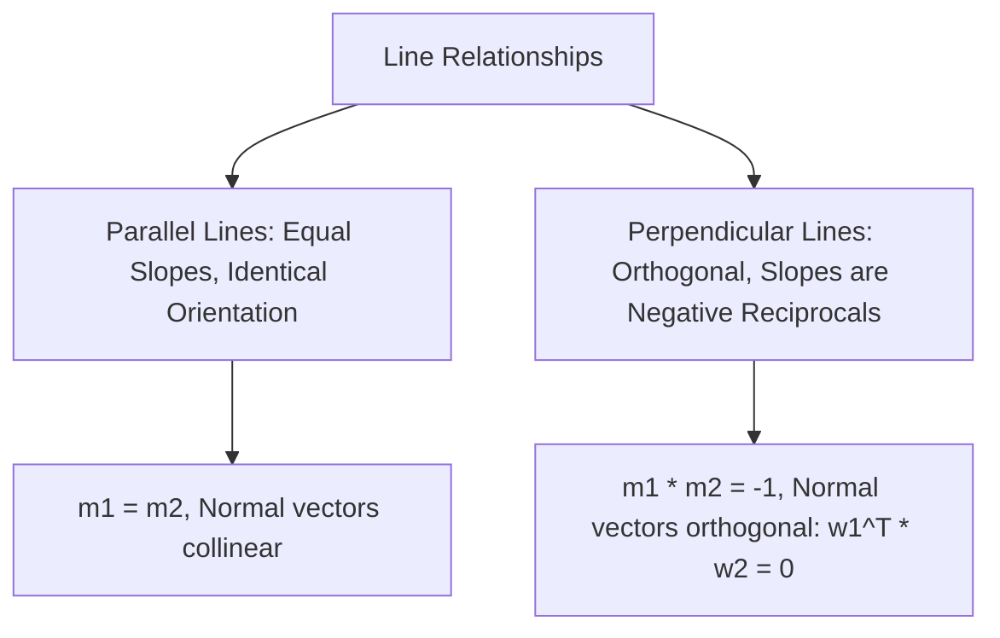

# Day 21 - Lecture 21.4: Parallel & Perpendicular Lines

[](https://www.python.org/)
[](lecture_21_04.ipynb)
[](notes.pdf)

🌐 **Language:** **English** | [हिंदी / Hinglish](README_HINGLISH.md) | [⬅️ Back to Lecture 21 Module](../README.md)

---

## 1. Overview & Geometric Orientation

Understanding the conditions for **parallelism** and **orthogonality (perpendicularity)** is essential for coordinate geometry, gradient ascent/descent, normal vector calculations, and Support Vector Machine margin construction.



---

## 2. Mathematical Formalism

### 1. Parallel Lines:
Two non-vertical lines $L_1: y = m_1 x + c_1$ and $L_2: y = m_2 x + c_2$ are parallel if and only if their slopes are strictly equal:

$$
\boxed{m_1 = m_2 \qquad (c_1 \ne c_2)}
$$

In general form $a_1 x + b_1 y + c_1 = 0$ and $a_2 x + b_2 y + c_2 = 0$:

$$
\boxed{\frac{a_1}{a_2} = \frac{b_1}{b_2} \ne \frac{c_1}{c_2}}
$$

### 2. Perpendicular (Orthogonal) Lines:
Two non-vertical lines $L_1$ and $L_2$ are mutually perpendicular if and only if the product of their slopes equals $-1$:

$$
\boxed{m_1 \cdot m_2 = -1 \iff m_2 = -\frac{1}{m_1}}
$$

In general form:

$$
\left(-\frac{a_1}{b_1}\right) \cdot \left(-\frac{a_2}{b_2}\right) = -1 \implies a_1 a_2 + b_1 b_2 = 0
$$

Notice that this is the **vector dot product** of their normal vectors $\mathbf{w}_1 = [a_1, b_1]^T$ and $\mathbf{w}_2 = [a_2, b_2]^T$:

$$
\boxed{\mathbf{w}_1^T \mathbf{w}_2 = 0 \iff L_1 \perp L_2}
$$

---

## 3. Python Implementation

```python
import numpy as np

# Line 1: 3x - 4y + 5 = 0 -> m1 = 3/4 = 0.75
a1, b1, c1 = 3.0, -4.0, 5.0
m1 = -a1 / b1

# Parallel Line 2: 3x - 4y - 10 = 0 -> m2 = 3/4 = 0.75
a2, b2, c2 = 3.0, -4.0, -10.0
m2 = -a2 / b2

# Perpendicular Line 3: 4x + 3y + 2 = 0 -> m3 = -4/3 = -1.333
a3, b3, c3 = 4.0, 3.0, 2.0
m3 = -a3 / b3

print(f"Slope m1: {m1:.4f}, Slope m2: {m2:.4f}, Slope m3: {m3:.4f}")
print(f"L1 and L2 Parallel:      {np.isclose(m1, m2)}")
print(f"L1 and L3 Perpendicular: {np.isclose(m1 * m3, -1.0)}")

# Vector dot product orthogonality check
w1 = np.array([a1, b1])
w3 = np.array([a3, b3])
print(f"Dot product w1 . w3:    {np.dot(w1, w3):.1f} (Must be 0)")
```

---

## 4. Key Takeaways & Interview Points
- **Dot Product Rule:** Two lines (or hyperplanes) are perpendicular if and only if the dot product of their normal weight vectors equals zero ($\mathbf{w}_1^T \mathbf{w}_2 = 0$).
- **Support Vector Machines:** The decision boundary and the margin planes are strictly parallel hyperplanes separated by bias offsets.
