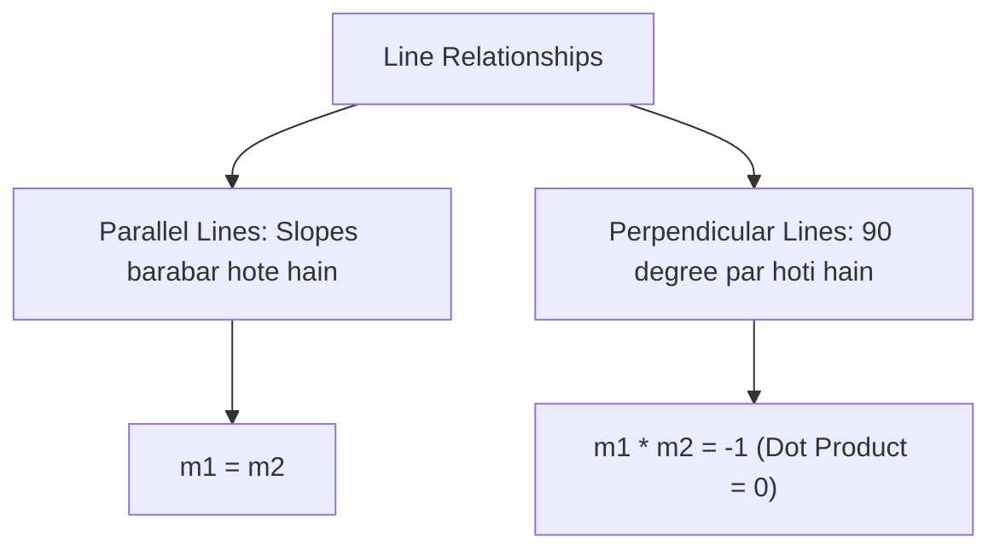

# Day 21 - Lecture 21.4: Samantar aur Lambvat Rekhayein (Parallel & Perpendicular Lines) [Hinglish]

[](https://www.python.org/)
[](lecture_21_04.ipynb)
[](notes.pdf)

🌐 **Language / भाषा:** [English](README.md) | **हिंदी / Hinglish** | [⬅️ Lecture 21 Module Par Wapas Jayein](../README_HINGLISH.md)

---

## 1. Overview & Orientation

Linear Algebra aur SVM (Support Vector Machines) me **Parallel** aur **Perpendicular** lines ke rules samajhna bohot zaroori hai.



---

## 2. Ganitiya Niyam

### Parallel Lines:

$$
\boxed{m_1 = m_2}
$$

### Perpendicular Lines (Lambvat Rekhayein):

$$
\boxed{m_1 \cdot m_2 = -1 \iff m_2 = -\frac{1}{m_1}}
$$

Vector roop me unke normal weight vectors ka dot product zero hota hai:

$$
\boxed{\mathbf{w}_1^T \mathbf{w}_2 = 0}
$$

---

## 3. Python Code

```python
import numpy as np

w1 = np.array([3.0, -4.0]) # Line 1 normal
w2 = np.array([4.0, 3.0])  # Line 2 normal

dot = np.dot(w1, w2)
print(f"Dot Product: {dot} -> Perpendicular: {dot == 0}")
```

---

## 4. Mukhya Batein (Key Takeaways) & Interview Points
- **Negative Reciprocal:** Perpendicular line ka slope hamesha $-\frac{1}{m}$ hota hai.
- **Zero Dot Product:** Orthogonality ka universal mathematical test dot product $= 0$ hota hai.
