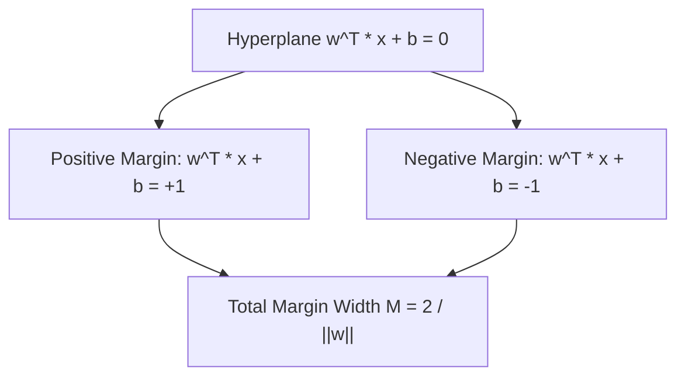

# Day 21 - Lecture 21.5: Distance Between Parallel Lines & Point-to-Line Distance

[](https://www.python.org/)
[](lecture_21_05.ipynb)
[](notes.pdf)

🌐 **Language:** **English** | [हिंदी / Hinglish](README_HINGLISH.md) | [⬅️ Back to Lecture 21 Module](../README.md)

---

## 1. Overview & Support Vector Machine (SVM) Foundation

The perpendicular distance from a data point to a hyperplane is the exact mathematical foundation of the **Support Vector Machine (SVM)** margin. The optimal hard-margin SVM seeks to maximize the distance between parallel boundary margins that flank the decision hyperplane.



---

## 2. Mathematical Formalism

### 1. Perpendicular Distance from Point $(x_0, y_0)$ to Line $ax + by + c = 0$:

$$
\boxed{d = \frac{|a x_0 + b y_0 + c|}{\sqrt{a^2 + b^2}}}
$$

In $n$-dimensional hyperplane vector notation $\mathbf{w}^T \mathbf{x} + b = 0$:

$$
\boxed{d(\mathbf{x}_0) = \frac{|\mathbf{w}^T \mathbf{x}_0 + b|}{\|\mathbf{w}\|_2}}
$$

### 2. Distance Between Two Parallel Lines:
For parallel lines $L_1: ax + by + c_1 = 0$ and $L_2: ax + by + c_2 = 0$:

$$
\boxed{d = \frac{|c_1 - c_2|}{\sqrt{a^2 + b^2}}}
$$

### 3. The SVM Margin Formula:
In SVM classification, the positive and negative support vector hyperplanes are given by:
- $L_+: \mathbf{w}^T \mathbf{x} + b = +1 \implies \mathbf{w}^T \mathbf{x} + (b - 1) = 0$
- $L_-: \mathbf{w}^T \mathbf{x} + b = -1 \implies \mathbf{w}^T \mathbf{x} + (b + 1) = 0$

The distance between these parallel hyperplanes (the margin width $M$) is:

$$
\boxed{M = \frac{|(b - 1) - (b + 1)|}{\|\mathbf{w}\|_2} = \frac{2}{\|\mathbf{w}\|_2}}
$$

Thus, **maximizing the margin $M$** is mathematically equivalent to **minimizing $\frac{1}{2}\|\mathbf{w}\|^2$**, which is the canonical SVM quadratic optimization objective!

---

## 3. Python Implementation

```python
import numpy as np

# Point-to-Line Distance: Point P(2, 3), Line 3x + 4y - 6 = 0
x0, y0 = 2.0, 3.0
a, b_line, c = 3.0, 4.0, -6.0

d_point = abs(a * x0 + b_line * y0 + c) / np.sqrt(a**2 + b_line**2)
print(f"Point-to-Line Distance: {d_point:.4f} (Exact: |6 + 12 - 6| / 5 = 12/5 = 2.4)")

# Distance between parallel lines: 3x + 4y - 6 = 0 and 3x + 4y + 9 = 0
c1, c2 = -6.0, 9.0
d_parallel = abs(c1 - c2) / np.sqrt(a**2 + b_line**2)
print(f"Distance between Parallel Lines: {d_parallel:.4f} (Exact: 15/5 = 3.0)")

# SVM Margin Width for weight vector w = [3, 4]
w = np.array([3.0, 4.0])
margin_width = 2.0 / np.linalg.norm(w)
print(f"SVM Margin Width M = 2 / ||w||: {margin_width:.4f} (Exact: 2/5 = 0.4)")
```

---

## 4. Key Takeaways & Interview Points
- **Origin of SVM Optimization:** SVM minimizes $\frac{1}{2}\|\mathbf{w}\|^2$ because the physical margin between parallel separating planes is $M = \frac{2}{\|\mathbf{w}\|}$.
- **Denominator is the Normal Norm:** The denominator $\sqrt{a^2 + b^2} = \|\mathbf{w}\|$ normalizes the line equation into a unit-length normal projection.
