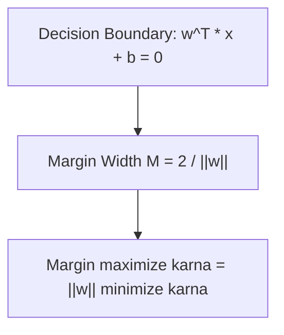

# Day 21 - Lecture 21.5: Parallel Lines ke Beech Doori aur Point-to-Line Distance [Hinglish]

[](https://www.python.org/)
[](lecture_21_05.ipynb)
[](notes.pdf)

🌐 **Language / भाषा:** [English](README.md) | **हिंदी / Hinglish** | [⬅️ Lecture 21 Module Par Wapas Jayein](../README_HINGLISH.md)

---

## 1. Overview & SVM ka Foundation

Point se line ki lambvat doori (perpendicular distance) aur do parallel lines ke beech ka gap **Support Vector Machine (SVM)** ka pura mathematical base banata hai.



---

## 2. Ganitiya Sutra

### Point $(x_0, y_0)$ se Line $ax + by + c = 0$ ki Doori:

$$
\boxed{d = \frac{|a x_0 + b y_0 + c|}{\sqrt{a^2 + b^2}}}
$$

### Do Parallel Lines ke Beech ki Doori:
Lines $ax + by + c_1 = 0$ aur $ax + by + c_2 = 0$ ke liye:

$$
\boxed{d = \frac{|c_1 - c_2|}{\sqrt{a^2 + b^2}}}
$$

### SVM Margin Formula:
Positive plane $\mathbf{w}^T \mathbf{x} + b = 1$ aur Negative plane $\mathbf{w}^T \mathbf{x} + b = -1$ ke beech total gap:

$$
\boxed{M = \frac{2}{\|\mathbf{w}\|}}
$$

Isi liye SVM me hum $\frac{1}{2}\|\mathbf{w}\|^2$ ko minimize karte hain taaki margin maximize ho sake.

---

## 3. Python Implementation

```python
import numpy as np

# Point (2, 3) se Line 3x + 4y - 6 = 0
x0, y0 = 2.0, 3.0
a, b, c = 3.0, 4.0, -6.0

d = abs(a*x0 + b*y0 + c) / np.sqrt(a**2 + b**2)
print(f"Perpendicular Distance: {d:.2f}")

# SVM Margin with w = [3, 4]
w = np.array([3.0, 4.0])
margin = 2.0 / np.linalg.norm(w)
print(f"SVM Margin Width: {margin:.2f}")
```

---

## 4. Mukhya Batein (Key Takeaways) & Interview Points
- **SVM Connection:** Margin ka formula seedha do parallel lines ke distance formula se derive hota hai.
- **Normalization:** Denominator $\sqrt{a^2 + b^2}$ normal vector ki length hoti hai.
