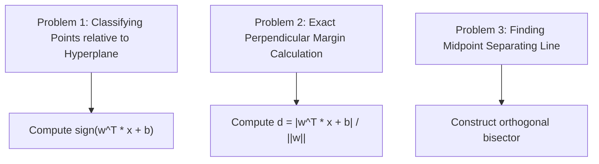

# Day 21 - Lecture 21.6: Practice Problems: Coordinate Geometry & Linear Boundaries

[](https://www.python.org/)
[](lecture_21_06.ipynb)
[](notes.pdf)

🌐 **Language:** **English** | [हिंदी / Hinglish](README_HINGLISH.md) | [⬅️ Back to Lecture 21 Module](../README.md)

---

## 1. Problem Formulations

This module applies coordinate geometry and distance theorems to practical machine learning decision boundary problems.



---

## 2. Analytical Problems & Step-by-Step Solutions

### Problem 1: Linear Classification Decision
Given decision boundary $L: 2x_1 + 5x_2 - 10 = 0$, classify the following test points:
- $P_1(3, 2)$: $f(3, 2) = 2(3) + 5(2) - 10 = 6 + 10 - 10 = +6 > 0 \implies \mathbf{\text{Class } +1}$.
- $P_2(1, 1)$: $f(1, 1) = 2(1) + 5(1) - 10 = 2 + 5 - 10 = -3 < 0 \implies \mathbf{\text{Class } -1}$.
- $P_3(0, 2)$: $f(0, 2) = 2(0) + 5(2) - 10 = 0 + 10 - 10 = 0 \implies \mathbf{\text{On Boundary}}$.

### Problem 2: Exact Distance to Decision Surface
What is the perpendicular distance from $P_1(3, 2)$ to the boundary $2x_1 + 5x_2 - 10 = 0$?

$$
\boxed{d = \frac{|2(3) + 5(2) - 10|}{\sqrt{2^2 + 5^2}} = \frac{6}{\sqrt{29}} \approx \frac{6}{5.3852} \approx 1.1142}
$$

### Problem 3: Parallel Margin Plane Equation
Find the parallel support vector hyperplane that passes directly through $P_1(3, 2)$:
Since it is parallel, normal vector $[a, b] = [2, 5]$ remains identical:
$2(3) + 5(2) + c_{\text{new}} = 0 \implies 16 + c_{\text{new}} = 0 \implies c_{\text{new}} = -16$.

$$
\boxed{2x_1 + 5x_2 - 16 = 0}
$$

Distance between this parallel plane and the decision boundary:

$$
\boxed{d = \frac{|-10 - (-16)|}{\sqrt{29}} = \frac{6}{\sqrt{29}} \approx 1.1142 \quad (\text{Matches!})}
$$

---

## 3. Python Verification

```python
import numpy as np

w = np.array([2.0, 5.0])
b = -10.0

points = {
    'P1': np.array([3.0, 2.0]),
    'P2': np.array([1.0, 1.0]),
    'P3': np.array([0.0, 2.0])
}

for name, pt in points.items():
    score = np.dot(w, pt) + b
    dist = abs(score) / np.linalg.norm(w)
    pred_class = "+1" if score > 0 else ("-1" if score < 0 else "Boundary")
    print(f"Point {name}: Score = {score:5.1f} | Class = {pred_class:8s} | Perpendicular Dist = {dist:.4f}")
```

---

## 4. Key Takeaways & Interview Points
- **Functional vs Geometric Margin:** The functional margin is $\hat{\gamma} = \mathbf{w}^T \mathbf{x} + b$; the physical geometric margin normalizes this by dividing by the Euclidean norm: $\gamma = \frac{\mathbf{w}^T \mathbf{x} + b}{\|\mathbf{w}\|}$.
