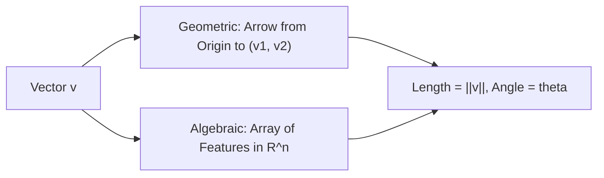

# Day 21 - Lecture 21.7: Vectors (Geometric & Algebraic Foundations)

[](https://www.python.org/)
[](lecture_21_07.ipynb)
[](notes.pdf)

🌐 **Language:** **English** | [हिंदी / Hinglish](README_HINGLISH.md) | [⬅️ Back to Lecture 21 Module](../README.md)

---

## 1. Dual Interpretations: Physics vs. Computer Science

A **vector** bridges physical geometry and abstract high-dimensional data representation:
1. **Geometric View (Physics):** A directed line segment characterized by a **magnitude (length)** and a **direction** in space.
2. **Algebraic View (Computer Science / AI):** An ordered tuple of real numbers representing an observation's feature values: $\mathbf{x} = [x_1, x_2, \dots, x_n]^T \in \mathbb{R}^n$.



---

## 2. Mathematical Formalism

### Column Vector Convention:
In linear algebra, vectors are universally assumed to be vertical column vectors:

$$
\boxed{\mathbf{v} = \begin{bmatrix} v_1 \\ v_2 \\ \vdots \\ v_n \end{bmatrix} \in \mathbb{R}^{n \times 1}, \qquad \mathbf{v}^T = \begin{bmatrix} v_1 & v_2 & \dots & v_n \end{bmatrix} \in \mathbb{R}^{1 \times n}}
$$

### Vector Norms (Magnitude Measurements):

#### 1. Euclidean Norm ($L_2$ Norm):
The physical straight-line length from the origin:

$$
\boxed{\|\mathbf{v}\|_2 = \sqrt{\mathbf{v}^T \mathbf{v}} = \sqrt{\sum_{i=1}^n v_i^2}}
$$

#### 2. Manhattan Norm ($L_1$ Norm):
Used for Lasso regularization to induce feature sparsity:

$$
\boxed{\|\mathbf{v}\|_1 = \sum_{i=1}^n |v_i|}
$$

#### 3. Maximum Norm ($L_\infty$ Norm):

$$
\boxed{\|\mathbf{v}\|_\infty = \max_{i} |v_i|}
$$

### Unit Vectors & Normalization:
A vector with unit length ($\|\hat{\mathbf{v}}\| = 1.0$) preserving pure direction:

$$
\boxed{\hat{\mathbf{v}} = \frac{\mathbf{v}}{\|\mathbf{v}\|_2}}
$$

---

## 3. Python Implementation

```python
import numpy as np

# 3D Feature vector
v = np.array([3.0, -4.0, 12.0])

# L2 Norm (Magnitude)
norm_l2 = np.linalg.norm(v, ord=2)

# L1 Norm
norm_l1 = np.linalg.norm(v, ord=1)

# L_inf Norm
norm_linf = np.linalg.norm(v, ord=np.inf)

# Unit Vector
v_unit = v / norm_l2

print(f"Vector v:       {v}")
print(f"L2 Norm (||v||): {norm_l2:.4f} (Exact: sqrt(9 + 16 + 144) = sqrt(169) = 13)")
print(f"L1 Norm:        {norm_l1:.4f} (Exact: 3 + 4 + 12 = 19)")
print(f"L_inf Norm:     {norm_linf:.4f} (Exact: 12)")
print(f"Unit Vector:    {v_unit}")
print(f"Unit Norm:      {np.linalg.norm(v_unit):.4f} (Must be 1.0)")
```

---

## 4. Key Takeaways & Interview Points
- **Normalization in NLP:** Word embeddings and transformer vectors are normalized to unit length so that dot product equals cosine similarity ($\mathbf{u} \cdot \mathbf{v} = \cos\theta$).
- **Regularization Connection:** Ridge regression applies an $L_2$ penalty $\|\mathbf{w}\|_2^2$; Lasso regression applies an $L_1$ penalty $\|\mathbf{w}\|_1$.
