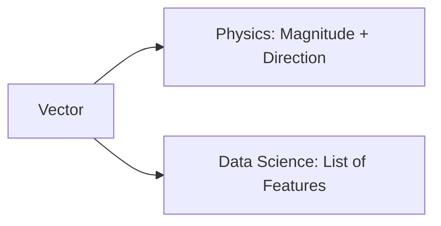

# Day 21 - Lecture 21.7: Vectors ke Buniyaadi Siddhant (Geometric & Algebraic) [Hinglish]

[](https://www.python.org/)
[](lecture_21_07.ipynb)
[](notes.pdf)

🌐 **Language / भाषा:** [English](README.md) | **हिंदी / Hinglish** | [⬅️ Lecture 21 Module Par Wapas Jayein](../README_HINGLISH.md)

---

## 1. Overview & Vectors ka Arth

Vector ke do roop hote hain:
1. **Geometric View (Physics):** Ek teer (arrow) jisme **magnitude (lambai)** aur **direction (dishaa)** dono hoti hain.
2. **Algebraic View (AI / CS):** Ek ordered list jisme features store hote hain: $\mathbf{x} = [x_1, x_2, \dots, x_n]^T$.



---

## 2. Ganitiya Sutra & Vector Norms

### $L_2$ Norm (Euclidean Magnitude):
Origin se seedhi lambai:

$$
\boxed{\|\mathbf{v}\|_2 = \sqrt{\sum_{i=1}^n v_i^2}}
$$

### $L_1$ Norm (Manhattan):

$$
\boxed{\|\mathbf{v}\|_1 = \sum_{i=1}^n |v_i|}
$$

### Unit Vector (Normalisation):
Vector ko uski lambai se divide karke unit vector banana:

$$
\boxed{\hat{\mathbf{v}} = \frac{\mathbf{v}}{\|\mathbf{v}\|}}
$$

---

## 3. Python Implementation

```python
import numpy as np

v = np.array([3.0, -4.0, 12.0])
l2 = np.linalg.norm(v)
unit_v = v / l2

print(f"Length ||v||: {l2} (Exact: 13.0)")
print(f"Unit Vector:  {unit_v}")
```

---

## 4. Mukhya Batein (Key Takeaways) & Interview Points
- **L1 vs L2 Regularization:** L1 norm ($Lasso$) weights ko zero banata hai (sparsity), jabki L2 norm ($Ridge$) weights ko chota rakhta hai.
- **Cosine Similarity:** Jab vectors unit-length hote hain, toh unka dot product seedhe cosine similarity ban jata hai.
