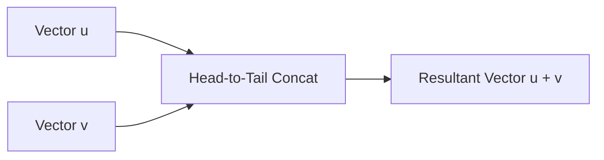

# Day 21 - Lecture 21.8: Vector Addition & Geometric Laws

[](https://www.python.org/)
[](lecture_21_08.ipynb)
[](notes.pdf)

🌐 **Language:** **English** | [हिंदी / Hinglish](README_HINGLISH.md) | [⬅️ Back to Lecture 21 Module](../README.md)

---

## 1. Overview & Component-wise Synthesis

Vector addition is the fundamental linear combination operation in vector spaces. Geometrically, it represents sequential spatial displacement. In Machine Learning, vector addition executes residual connections ($x + f(x)$ in ResNets), word embedding semantics ($\vec{v}_{\text{king}} - \vec{v}_{\text{man}} + \vec{v}_{\text{woman}} \approx \vec{v}_{\text{queen}}$), and gradient parameter updates.



---

## 2. Mathematical Formalism

### 1. Component-wise Algebraic Definition:
For vectors $\mathbf{u}, \mathbf{v} \in \mathbb{R}^n$:

$$
\boxed{\mathbf{u} + \mathbf{v} = \begin{bmatrix} u_1 \\ u_2 \\ \vdots \\ u_n \end{bmatrix} + \begin{bmatrix} v_1 \\ v_2 \\ \vdots \\ v_n \end{bmatrix} = \begin{bmatrix} u_1 + v_1 \\ u_2 + v_2 \\ \vdots \\ u_n + v_n \end{bmatrix}}
$$

### 2. Geometric Laws of Addition:
1. **Triangle Law of Addition (Head-to-Tail):** Place the tail of $\mathbf{v}$ at the head of $\mathbf{u}$. The vector from the tail of $\mathbf{u}$ to the head of $\mathbf{v}$ is $\mathbf{u} + \mathbf{v}$.
2. **Parallelogram Law of Addition:** If $\mathbf{u}$ and $\mathbf{v}$ emanate from the same origin, the resultant $\mathbf{u} + \mathbf{v}$ is the diagonal of the parallelogram formed by $\mathbf{u}$ and $\mathbf{v}$.

### 3. Triangle Inequality Theorem:
The length of any side of a triangle cannot exceed the sum of the lengths of the other two sides:

$$
\boxed{\|\mathbf{u} + \mathbf{v}\| \le \|\mathbf{u}\| + \|\mathbf{v}\|}
$$

Equality $\|\mathbf{u} + \mathbf{v}\| = \|\mathbf{u}\| + \|\mathbf{v}\|$ holds if and only if $\mathbf{u}$ and $\mathbf{v}$ are collinear and point in the identical direction.

---

## 3. Python Implementation

```python
import numpy as np

u = np.array([3.0, 1.0])
v = np.array([1.0, 4.0])

# Resultant vector
w = u + v

norm_u = np.linalg.norm(u)
norm_v = np.linalg.norm(v)
norm_w = np.linalg.norm(w)

print(f"Vector u: {u}")
print(f"Vector v: {v}")
print(f"Vector u + v: {w}")
print(f"\n||u|| = {norm_u:.4f}, ||v|| = {norm_v:.4f}")
print(f"||u + v|| = {norm_w:.4f} <= ||u|| + ||v|| ({norm_u + norm_v:.4f})")
print(f"Triangle Inequality holds: {norm_w <= norm_u + norm_v}")
```

---

## 4. Key Takeaways & Interview Points
- **ResNet Residual Connections:** Deep learning models with hundreds of layers succeed because vector addition $\mathbf{x}_{\ell+1} = \mathbf{x}_\ell + \mathcal{F}(\mathbf{x}_\ell)$ allows gradients to flow backwards without vanishing.
- **Commutative & Associative:** Vector addition is abelian: $\mathbf{u} + \mathbf{v} = \mathbf{v} + \mathbf{u}$ and $(\mathbf{u} + \mathbf{v}) + \mathbf{w} = \mathbf{u} + (\mathbf{v} + \mathbf{w})$.
