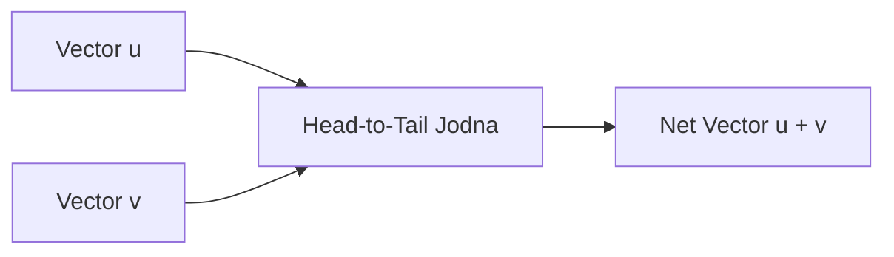

# Day 21 - Lecture 21.8: Vector Addition aur Triangle/Parallelogram Niyam [Hinglish]

[](https://www.python.org/)
[](lecture_21_08.ipynb)
[](notes.pdf)

🌐 **Language / भाषा:** [English](README.md) | **हिंदी / Hinglish** | [⬅️ Lecture 21 Module Par Wapas Jayein](../README_HINGLISH.md)

---

## 1. Overview & Concept

Vector addition do vectors ko jod kar unka net resultant nikalne ka process hai. Machine learning me ResNet ki residual connections ($\mathbf{x} + \mathcal{F}(\mathbf{x})$) aur word embeddings addition par hi kaam karte hain.



---

## 2. Ganitiya Sutra

### Component-wise Addition:

$$
\boxed{\mathbf{u} + \mathbf{v} = \begin{bmatrix} u_1 + v_1 \\ u_2 + v_2 \\ \vdots \\ u_n + v_n \end{bmatrix}}
$$

### Triangle Inequality:
Resultant vector ki lambai dono vectors ki alag-alag lambai ke jod se zyada kabhi nahi ho sakti:

$$
\boxed{\|\mathbf{u} + \mathbf{v}\| \le \|\mathbf{u}\| + \|\mathbf{v}\|}
$$

---

## 3. Python Implementation

```python
import numpy as np

u = np.array([3.0, 1.0])
v = np.array([1.0, 4.0])
w = u + v

print(f"u + v = {w}")
print(f"||u + v|| = {np.linalg.norm(w):.2f}")
```

---

## 4. Mukhya Batein (Key Takeaways) & Interview Points
- **ResNet Skip Connection:** Neural networks me vanishing gradient se bachne ke liye vector addition $\mathbf{x} + \mathcal{F}(\mathbf{x})$ ka use hota hai.
