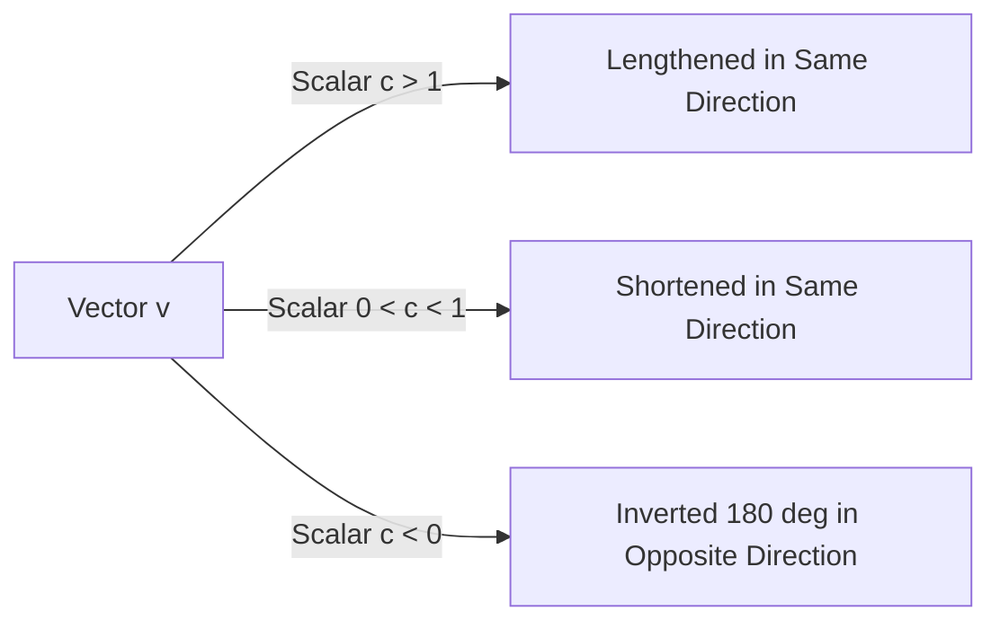

# Day 21 - Lecture 21.9: Scalar Multiplication & Linear Scaling

[](https://www.python.org/)
[](lecture_21_09.ipynb)
[](notes.pdf)

🌐 **Language:** **English** | [हिंदी / Hinglish](README_HINGLISH.md) | [⬅️ Back to Lecture 21 Module](../README.md)

---

## 1. Overview & Operational Scaling

**Scalar Multiplication** scales a vector by a real scalar number $c \in \mathbb{R}$. In Machine Learning optimization, scalar multiplication directly governs the step size of **Gradient Descent**:

$$
\boxed{\boldsymbol{\theta}_{t+1} = \boldsymbol{\theta}_t - \eta \cdot \nabla_\theta \mathcal{L}(\boldsymbol{\theta}_t)}
$$

where the learning rate $\eta$ is a scalar multiplier that scales the gradient vector $\nabla \mathcal{L}$.



---

## 2. Mathematical Formalism

### Component-wise Definition:
For scalar $c \in \mathbb{R}$ and vector $\mathbf{v} \in \mathbb{R}^n$:

$$
\boxed{c \cdot \mathbf{v} = c \begin{bmatrix} v_1 \\ v_2 \\ \vdots \\ v_n \end{bmatrix} = \begin{bmatrix} c \cdot v_1 \\ c \cdot v_2 \\ \vdots \\ c \cdot v_n \end{bmatrix}}
$$

### Norm Scaling Law:
The magnitude of the scaled vector scales by the absolute value of the scalar:

$$
\boxed{\|c \cdot \mathbf{v}\|_2 = |c| \cdot \|\mathbf{v}\|_2}
$$

### Directional Properties:
- If $c > 0$: Preserves orientation ($\text{angle} = 0^\circ$).
- If $c = 0$: Collapses the vector to the null vector $\mathbf{0}$.
- If $c < 0$: Inverts orientation completely ($\text{angle} = 180^\circ$).

---

## 3. Python Implementation

```python
import numpy as np

v = np.array([3.0, 4.0])
c_pos = 2.5
c_neg = -1.5

v_scaled_pos = c_pos * v
v_scaled_neg = c_neg * v

print(f"Original v:            {v}, ||v|| = {np.linalg.norm(v):.2f}")
print(f"Scaled by {c_pos:4.1f}:       {v_scaled_pos}, ||c*v|| = {np.linalg.norm(v_scaled_pos):.2f} (Target: {abs(c_pos)*5:.2f})")
print(f"Scaled by {c_neg:4.1f}:       {v_scaled_neg}, ||c*v|| = {np.linalg.norm(v_scaled_neg):.2f} (Target: {abs(c_neg)*5:.2f})")
```

---

## 4. Key Takeaways & Interview Points
- **Learning Rate as Scalar:** If $\eta$ is too large, scalar multiplication causes gradient steps to explode; if $\eta$ is too small, steps become imperceptible.
- **Span of a Vector:** The set of all scalar multiples $\{c \mathbf{v} \mid c \in \mathbb{R}\}$ forms a 1D continuous subspace (a line through the origin).
