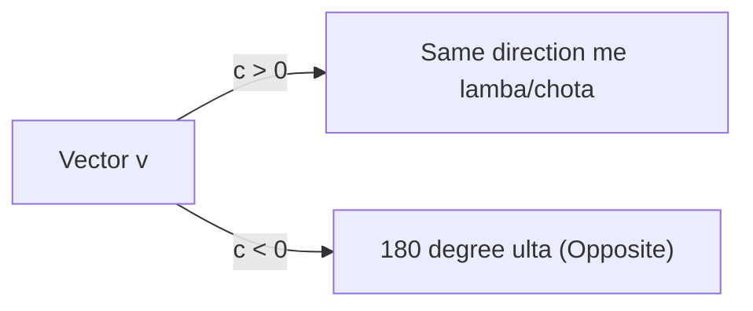

# Day 21 - Lecture 21.9: Scalar Multiplication aur Linear Scaling [Hinglish]

[](https://www.python.org/)
[](lecture_21_09.ipynb)
[](notes.pdf)

🌐 **Language / भाषा:** [English](README.md) | **हिंदी / Hinglish** | [⬅️ Lecture 21 Module Par Wapas Jayein](../README_HINGLISH.md)

---

## 1. Overview & Concept

**Scalar Multiplication** kisi vector ko ek aam number (scalar $c$) se multiply karne ka process hai. Machine learning me Gradient Descent ka learning rate $\eta$ yahi scalar multiplication perform karta hai: $\boldsymbol{\theta} \leftarrow \boldsymbol{\theta} - \eta \nabla \mathcal{L}$.



---

## 2. Ganitiya Sutra

$$
\boxed{c \cdot \mathbf{v} = \begin{bmatrix} c \cdot v_1 \\ c \cdot v_2 \\ \vdots \\ c \cdot v_n \end{bmatrix}}
$$

$$
\boxed{\|c \cdot \mathbf{v}\| = |c| \cdot \|\mathbf{v}\|}
$$

---

## 3. Python Implementation

```python
import numpy as np

v = np.array([3.0, 4.0])
scaled = 2.0 * v
print(f"Original: {v}, Scaled: {scaled}")
print(f"New Length: {np.linalg.norm(scaled)}")
```

---

## 4. Mukhya Batein (Key Takeaways) & Interview Points
- **Negative Scalar:** Negative number se multiply karne par vector ki dishaa 180 degree palat jati hai.
