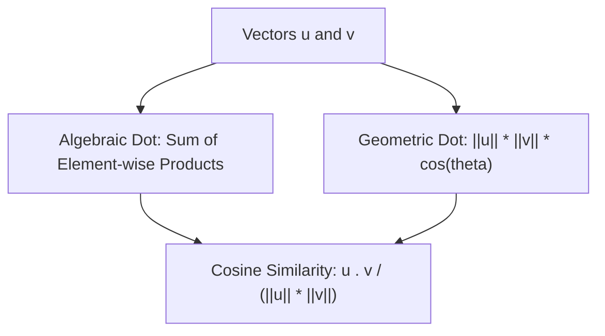

# Day 21 - Lecture 21.10: The Dot Product (Inner Product)

[](https://www.python.org/)
[](lecture_21_10.ipynb)
[](notes.pdf)

🌐 **Language:** **English** | [हिंदी / Hinglish](README_HINGLISH.md) | [⬅️ Back to Lecture 21 Module](../README.md)

---

## 1. Overview & Fundamental Role in AI

The **Dot Product** (Inner Product) is arguably the single most important operation in modern Machine Learning. It computes a scalar measure of directional alignment and similarity between two vectors. It powers:
- **Artificial Neurons:** $z = \mathbf{w} \cdot \mathbf{x} + b$
- **Transformer Self-Attention:** $\text{Attention}(Q, K, V) = \text{softmax}\left(\frac{Q K^T}{\sqrt{d_k}}\right) V$
- **Cosine Similarity:** Semantic search and LLM retrieval-augmented generation (RAG).



---

## 2. Mathematical Formalism

### 1. Algebraic Formulation:
For vectors $\mathbf{u}, \mathbf{v} \in \mathbb{R}^n$:

$$
\boxed{\mathbf{u} \cdot \mathbf{v} = \mathbf{u}^T \mathbf{v} = \sum_{i=1}^n u_i v_i = u_1 v_1 + u_2 v_2 + \dots + u_n v_n}
$$

### 2. Geometric Formulation:

$$
\boxed{\mathbf{u} \cdot \mathbf{v} = \|\mathbf{u}\|_2 \|\mathbf{v}\|_2 \cos(\theta)}
$$

where $\theta \in [0, \pi]$ is the interior angle between the vectors.

### 3. Orthogonality Condition:
Two non-zero vectors are perpendicular if and only if their dot product vanishes:

$$
\boxed{\mathbf{u} \perp \mathbf{v} \iff \mathbf{u} \cdot \mathbf{v} = 0}
$$

### 4. Cosine Similarity & Vector Projection:

$$
\boxed{\cos(\theta) = \frac{\mathbf{u} \cdot \mathbf{v}}{\|\mathbf{u}\|_2 \|\mathbf{v}\|_2}}
$$

The scalar orthogonal projection of $\mathbf{u}$ onto $\mathbf{v}$:

$$
\boxed{\text{proj}_{\mathbf{v}}(\mathbf{u}) = \frac{\mathbf{u} \cdot \mathbf{v}}{\|\mathbf{v}\|_2^2} \mathbf{v}}
$$

---

## 3. Python Implementation

```python
import numpy as np

# Word embeddings representing semantic concepts
u = np.array([1.0, 2.0, 3.0])
v = np.array([4.0, 5.0, 6.0])

# Algebraic Dot Product
dot_val = np.dot(u, v)

# Norms
norm_u = np.linalg.norm(u)
norm_v = np.linalg.norm(v)

# Cosine Similarity
cos_sim = dot_val / (norm_u * norm_v)
angle_rad = np.arccos(np.clip(cos_sim, -1.0, 1.0))
angle_deg = np.degrees(angle_rad)

print(f"u . v:               {dot_val:.2f} (Exact: 4 + 10 + 18 = 32)")
print(f"Cosine Similarity:   {cos_sim:.4f}")
print(f"Angle between u & v: {angle_deg:.2f} degrees")
```

---

## 4. Key Takeaways & Interview Points
- **Attention is Dot Product:** In Transformers, Attention measures the query-key affinity through scaled dot products ($Q K^T$).
- **Cauchy-Schwarz Inequality:** $|\mathbf{u} \cdot \mathbf{v}| \le \|\mathbf{u}\| \|\mathbf{v}\|$. Equality holds if and only if $\mathbf{u}$ and $\mathbf{v}$ are linearly dependent.
