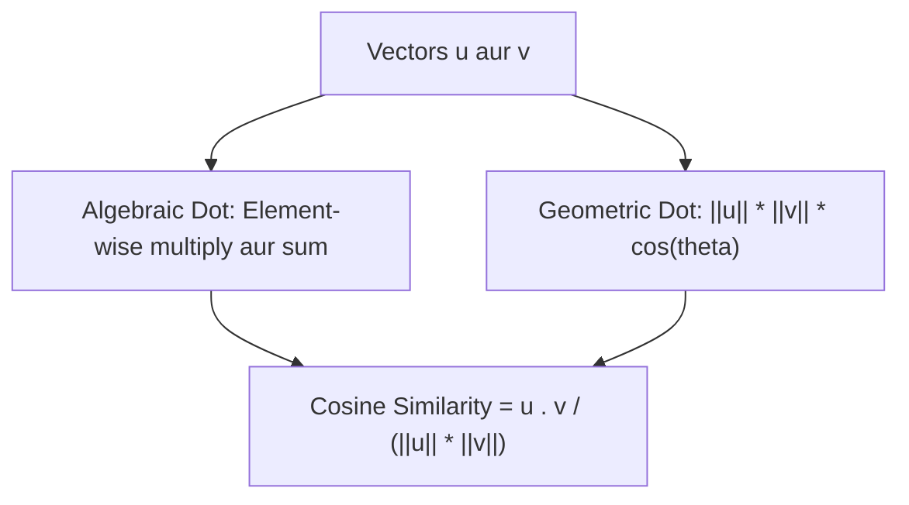

# Day 21 - Lecture 21.10: The Dot Product (Adish Gunanfal) [Hinglish]

[](https://www.python.org/)
[](lecture_21_10.ipynb)
[](notes.pdf)

🌐 **Language / भाषा:** [English](README.md) | **हिंदी / Hinglish** | [⬅️ Lecture 21 Module Par Wapas Jayein](../README_HINGLISH.md)

---

## 1. Overview & AI me Mahatva

**Dot Product** Machine Learning aur Deep Learning ka sabse mukhya operation hai. Neural Network ka artificial neuron $\mathbf{w} \cdot \mathbf{x} + b$, Transformer Attention mechanism, aur vector similarity search sabhi dot product par chalte hain.



---

## 2. Ganitiya Sutra

### Algebraic Formula:

$$
\boxed{\mathbf{u} \cdot \mathbf{v} = \sum_{i=1}^n u_i v_i}
$$

### Geometric Formula:

$$
\boxed{\mathbf{u} \cdot \mathbf{v} = \|\mathbf{u}\| \|\mathbf{v}\| \cos(\theta)}
$$

### Cosine Similarity:

$$
\boxed{\cos(\theta) = \frac{\mathbf{u} \cdot \mathbf{v}}{\|\mathbf{u}\| \|\mathbf{v}\|}}
$$

Agar do vectors perpendicular (90 degree) hon toh unka dot product hamesha **0** hota hai.

---

## 3. Python Implementation

```python
import numpy as np

u = np.array([1.0, 2.0, 3.0])
v = np.array([4.0, 5.0, 6.0])

dot = np.dot(u, v)
cos_sim = dot / (np.linalg.norm(u) * np.linalg.norm(v))

print(f"Dot Product:       {dot}")
print(f"Cosine Similarity: {cos_sim:.4f}")
```

---

## 4. Mukhya Batein (Key Takeaways) & Interview Points
- **Self Attention:** Transformers me Query ($Q$) aur Key ($K$) ke beech alignment calculate karne ke liye Dot Product ($QK^T$) use hota hai.
- **RAG & Search:** Vector databases (Pinecone, ChromaDB) semantic similarity nikalne ke liye Cosine Similarity use karte hain.
