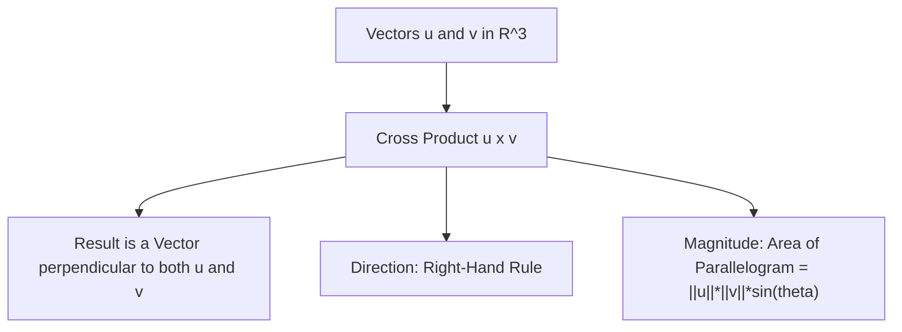

# Day 21 - Lecture 21.11: The Cross Product

[](https://www.python.org/)
[](lecture_21_11.ipynb)
[](notes.pdf)

🌐 **Language:** **English** | [हिंदी / Hinglish](README_HINGLISH.md) | [⬅️ Back to Lecture 21 Module](../README.md)

---

## 1. Overview & 3D Spatial Geometry

While the dot product yields a scalar, the **Cross Product** of two 3D vectors $\mathbf{u}, \mathbf{v} \in \mathbb{R}^3$ yields a new **vector** that is strictly perpendicular to both input vectors simultaneously. In Robotics, Computer Vision, and 3D Generative AI (NeRFs, Gaussian Splatting), cross products calculate surface normals, rotational torque, and plane orientations.



---

## 2. Mathematical Formalism

### 1. Determinant Expansion Definition:
For vectors $\mathbf{u} = [u_1, u_2, u_3]^T$ and $\mathbf{v} = [v_1, v_2, v_3]^T$:

$$
\boxed{\mathbf{u} \times \mathbf{v} = \det \begin{bmatrix} \hat{\mathbf{i}} & \hat{\mathbf{j}} & \hat{\mathbf{k}} \\ u_1 & u_2 & u_3 \\ v_1 & v_2 & v_3 \end{bmatrix} = \begin{bmatrix} u_2 v_3 - u_3 v_2 \\ u_3 v_1 - u_1 v_3 \\ u_1 v_2 - u_2 v_1 \end{bmatrix}}
$$

### 2. Geometric Magnitude & Direction:

$$
\boxed{\|\mathbf{u} \times \mathbf{v}\| = \|\mathbf{u}\|_2 \|\mathbf{v}\|_2 \sin(\theta)}
$$

where $\|\mathbf{u} \times \mathbf{v}\|$ equals the exact **area of the parallelogram** spanned by $\mathbf{u}$ and $\mathbf{v}$.

### 3. Key Algebraic Properties:
- **Anti-commutative:** $\mathbf{u} \times \mathbf{v} = -(\mathbf{v} \times \mathbf{u})$
- **Self Cross-Product:** $\mathbf{u} \times \mathbf{u} = \mathbf{0}$
- **Parallelism Test:** $\mathbf{u} \parallel \mathbf{v} \iff \mathbf{u} \times \mathbf{v} = \mathbf{0}$

---

## 3. Python Implementation

```python
import numpy as np

u = np.array([1.0, 0.0, 0.0])  # Unit vector along X
v = np.array([0.0, 1.0, 0.0])  # Unit vector along Y

# Cross Product
w = np.cross(u, v)

print(f"u:       {u}")
print(f"v:       {v}")
print(f"u x v:   {w} (Expected: [0, 0, 1] along Z)")
print(f"Orthogonal to u: {np.dot(w, u) == 0}")
print(f"Orthogonal to v: {np.dot(w, v) == 0}")

# Parallelogram Area
area = np.linalg.norm(w)
print(f"Parallelogram Area: {area:.2f}")
```

---

## 4. Key Takeaways & Interview Points
- **Strictly in 3D:** Cross product is uniquely defined for vectors in $\mathbb{R}^3$ (and algebraically in $\mathbb{R}^7$).
- **Computer Vision Surface Normals:** Estimating surface mesh orientations requires computing cross products between adjacent triangle edge vectors.
