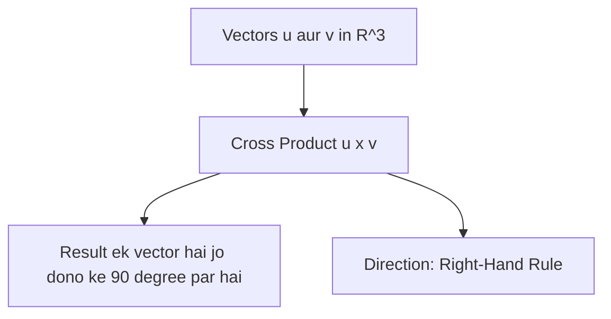

# Day 21 - Lecture 21.11: The Cross Product (Sadish Gunanfal) [Hinglish]

[](https://www.python.org/)
[](lecture_21_11.ipynb)
[](notes.pdf)

🌐 **Language / भाषा:** [English](README.md) | **हिंदी / Hinglish** | [⬅️ Lecture 21 Module Par Wapas Jayein](../README_HINGLISH.md)

---

## 1. Overview & 3D Spatial Geometry

Dot Product ka result ek scalar (number) hota hai, jabki **Cross Product** ($\mathbf{u} \times \mathbf{v}$) ka result ek naya **vector** hota hai jo dono input vectors ke perpendicular (90 degree) hota hai. Robotics aur 3D Computer Vision me surface normal nikalne ke liye yeh use hota hai.



---

## 2. Ganitiya Sutra

$$
\boxed{\mathbf{u} \times \mathbf{v} = \begin{bmatrix} u_2 v_3 - u_3 v_2 \\ u_3 v_1 - u_1 v_3 \\ u_1 v_2 - u_2 v_1 \end{bmatrix}}
$$

$$
\boxed{\|\mathbf{u} \times \mathbf{v}\| = \|\mathbf{u}\| \|\mathbf{v}\| \sin(\theta)}
$$

Cross product ka magnitude dono vectors se banne wale **parallelogram ka area** hota hai.

---

## 3. Python Implementation

```python
import numpy as np

u = np.array([1.0, 0.0, 0.0])
v = np.array([0.0, 1.0, 0.0])
w = np.cross(u, v)

print(f"u x v = {w} (Z axis vector)")
```

---

## 4. Mukhya Batein (Key Takeaways) & Interview Points
- **Anti-Commutative:** $\mathbf{u} \times \mathbf{v} = -(\mathbf{v} \times \mathbf{u})$ (order badalne par sign ulta ho jata hai).
- **Parallel Test:** Agar do vectors parallel hain toh unka cross product $\mathbf{0}$ hota hai.
