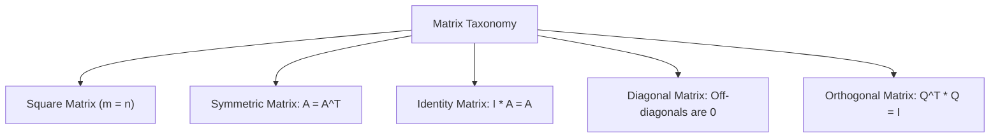

# Day 21 - Lecture 21.12: Matrices (Taxonomy & Special Structures)

[](https://www.python.org/)
[](lecture_21_12.ipynb)
[](notes.pdf)

🌐 **Language:** **English** | [हिंदी / Hinglish](README_HINGLISH.md) | [⬅️ Back to Lecture 21 Module](../README.md)

---

## 1. Overview & Matrix Representation

A **Matrix** is a two-dimensional rectangular array of numbers arranged into $m$ rows and $n$ columns ($\mathbf{A} \in \mathbb{R}^{m \times n}$). In Machine Learning, matrices represent:
- **Datasets:** $N$ rows (samples) and $D$ columns (features).
- **Neural Network Weights:** Linear transformation mappings from layer $\ell$ to layer $\ell+1$.
- **Graph Adjacency:** Connections in Graph Neural Networks (GNNs).



---

## 2. Mathematical Formalism: Special Matrix Classes

### 1. Identity Matrix ($\mathbf{I}_n$):
The multiplicative neutral element of matrix algebra:

$$
\boxed{\mathbf{I}_n = \begin{bmatrix} 1 & 0 & \dots & 0 \\ 0 & 1 & \dots & 0 \\ \vdots & \vdots & \ddots & \vdots \\ 0 & 0 & \dots & 1 \end{bmatrix}, \qquad \mathbf{A} \mathbf{I} = \mathbf{I} \mathbf{A} = \mathbf{A}}
$$

### 2. Symmetric Matrix:
A square matrix identical to its transpose:

$$
\boxed{\mathbf{A} = \mathbf{A}^T \iff a_{ij} = a_{ji} \quad \forall i, j}
$$

> [!NOTE]
> In Machine Learning, the **Covariance Matrix** $\mathbf{\Sigma} = \frac{1}{n} \mathbf{X}^T \mathbf{X}$ and the **Hessian Matrix** of second derivatives $\mathbf{H}_{ij} = \frac{\partial^2 \mathcal{L}}{\partial \theta_i \partial \theta_j}$ are always strictly symmetric!

### 3. Orthogonal Matrix:
A square matrix whose columns (and rows) form an orthonormal basis:

$$
\boxed{\mathbf{Q}^T \mathbf{Q} = \mathbf{Q} \mathbf{Q}^T = \mathbf{I} \iff \mathbf{Q}^{-1} = \mathbf{Q}^T}
$$

Orthogonal transformations represent pure spatial **rotations and reflections**, perfectly preserving vector norms and angles ($\|\mathbf{Q}\mathbf{x}\|_2 = \|\mathbf{x}\|_2$).

---

## 3. Python Implementation

```python
import numpy as np

# 1. Identity Matrix
I = np.eye(3)

# 2. Diagonal Matrix
D = np.diag([2.0, 5.0, -1.0])

# 3. Symmetric Covariance Matrix construction
X = np.random.randn(100, 3)
cov_matrix = np.dot(X.T, X) / 100
is_sym = np.allclose(cov_matrix, cov_matrix.T)

# 4. 2D Rotation Matrix (Orthogonal)
theta = np.radians(45)
Q = np.array([
    [np.cos(theta), -np.sin(theta)],
    [np.sin(theta),  np.cos(theta)]
])
is_ortho = np.allclose(np.dot(Q.T, Q), np.eye(2))

print("Is Covariance Matrix Symmetric:", is_sym)
print("Is 2D Rotation Matrix Orthogonal:", is_ortho)
print(f"Norm preservation check: ||x||={1.0:.2f}, ||Qx||={np.linalg.norm(np.dot(Q, [1, 0])):.2f}")
```

---

## 4. Key Takeaways & Interview Points
- **Covariance is Symmetric:** $\mathbf{X}^T \mathbf{X}$ is always symmetric and positive semi-definite.
- **Orthogonal Inversion is Free:** Calculating the inverse of an orthogonal matrix requires zero computational cost: simply take the transpose ($\mathbf{Q}^{-1} = \mathbf{Q}^T$).
