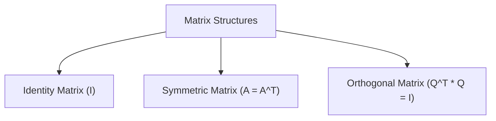

# Day 21 - Lecture 21.12: Matrices ke Prakar aur Special Structures [Hinglish]

[](https://www.python.org/)
[](lecture_21_12.ipynb)
[](notes.pdf)

🌐 **Language / भाषा:** [English](README.md) | **हिंदी / Hinglish** | [⬅️ Lecture 21 Module Par Wapas Jayein](../README_HINGLISH.md)

---

## 1. Overview & Types of Matrices

Machine Learning me data table, neural network weights, aur covariance structures sabhi **Matrices** ($\mathbf{A} \in \mathbb{R}^{m \times n}$) ke roop me store hote hain.



---

## 2. Special Matrices

### 1. Identity Matrix ($\mathbf{I}$):
Jaise aam multiplication me $1$ hota hai, waise matrix me $\mathbf{I}$ hota hai ($\mathbf{A}\mathbf{I} = \mathbf{A}$).

### 2. Symmetric Matrix ($\mathbf{A} = \mathbf{A}^T$):
Machine Learning ka **Covariance Matrix** $\mathbf{\Sigma} = \frac{1}{n} \mathbf{X}^T \mathbf{X}$ hamesha symmetric hota hai.

### 3. Orthogonal Matrix ($\mathbf{Q}^{-1} = \mathbf{Q}^T$):
Inka inverse nikalna bohot aasan hota hai (sirf transpose lo). Yeh data ko bina distort kiye rotate karti hain.

---

## 3. Python Implementation

```python
import numpy as np

# Identity
I = np.eye(3)

# Symmetric matrix check
X = np.random.randn(50, 3)
cov = np.dot(X.T, X)
print("Symmetric:", np.allclose(cov, cov.T))
```

---

## 4. Mukhya Batein (Key Takeaways) & Interview Points
- **Covariance Property:** $\mathbf{X}^T \mathbf{X}$ hamesha symmetric hota hai.
- **Orthogonal Inverse:** $\mathbf{Q}^{-1} = \mathbf{Q}^T$.
