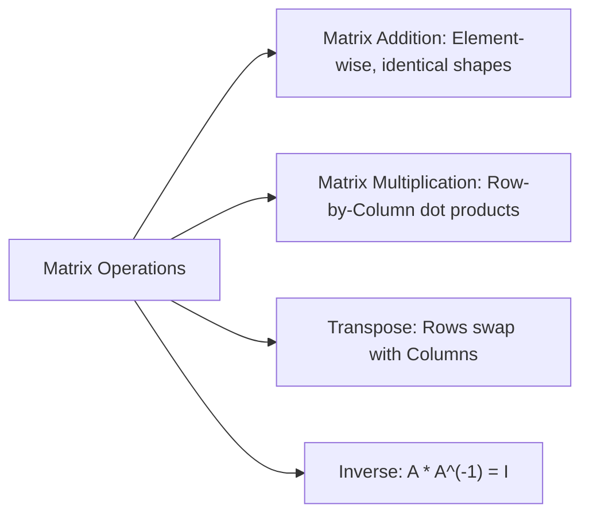

# Day 21 - Lecture 21.13: Operations on Matrices

[](https://www.python.org/)
[](lecture_21_13.ipynb)
[](notes.pdf)

🌐 **Language:** **English** | [हिंदी / Hinglish](README_HINGLISH.md) | [⬅️ Back to Lecture 21 Module](../README.md)

---

## 1. Overview & Computational Mechanics

Matrix operations form the core arithmetic executed by neural network inference engines, PyTorch tensors, and GPU BLAS routines.



---

## 2. Mathematical Formalism

### 1. Matrix Multiplication (GEMM):
For matrices $\mathbf{A} \in \mathbb{R}^{m \times k}$ and $\mathbf{B} \in \mathbb{R}^{k \times n}$, the product $\mathbf{C} = \mathbf{A}\mathbf{B} \in \mathbb{R}^{m \times n}$ has entries:

$$
\boxed{c_{ij} = \sum_{\ell=1}^k a_{i\ell} b_{\ell j}}
$$

> [!WARNING]
> **Non-Commutative:** Matrix multiplication is **not** commutative: in general, $\mathbf{A}\mathbf{B} \ne \mathbf{B}\mathbf{A}$.

### 2. Transpose Properties:

$$
\boxed{(\mathbf{A} + \mathbf{B})^T = \mathbf{A}^T + \mathbf{B}^T}
$$

$$
\boxed{(\mathbf{A}\mathbf{B})^T = \mathbf{B}^T \mathbf{A}^T \quad \text{(Order Inversion)}}
$$

### 3. Matrix Inverse:
For a non-singular square matrix $\mathbf{A} \in \mathbb{R}^{n \times n}$:

$$
\boxed{\mathbf{A} \mathbf{A}^{-1} = \mathbf{A}^{-1} \mathbf{A} = \mathbf{I}_n}
$$

$$
\boxed{(\mathbf{A}\mathbf{B})^{-1} = \mathbf{B}^{-1} \mathbf{A}^{-1}}
$$

### 4. Normal Equation in Linear Regression:
The closed-form analytical solution that minimizes Ordinary Least Squares loss:

$$
\boxed{\mathbf{w}^* = (\mathbf{X}^T \mathbf{X})^{-1} \mathbf{X}^T \mathbf{y}}
$$

---

## 3. Python Implementation

```python
import numpy as np

A = np.array([[1, 2], [3, 4]])
B = np.array([[5, 6], [7, 8]])

# 1. Matrix Multiplication
C = np.dot(A, B) # Or A @ B

# 2. Non-commutativity check
BA = np.dot(B, A)
print("A @ B:\n", C)
print("B @ A:\n", BA)
print("A@B == B@A:", np.array_equal(C, BA))

# 3. Transpose Inversion Property: (A @ B).T == B.T @ A.T
print("(AB)^T == B^T A^T:", np.allclose(C.T, np.dot(B.T, A.T)))

# 4. Matrix Inverse
A_inv = np.linalg.inv(A)
print("A @ A_inv (Identity):\n", np.round(np.dot(A, A_inv), 4))
```

---

## 4. Key Takeaways & Interview Points
- **Transpose of Product Reverses Order:** $(\mathbf{A}\mathbf{B}\mathbf{C})^T = \mathbf{C}^T \mathbf{B}^T \mathbf{A}^T$.
- **Never Invert Explicitly in Production:** Computing $(\mathbf{X}^T \mathbf{X})^{-1}$ directly is numerically unstable ($O(n^3)$ complexity). Production ML libraries solve linear systems via QR decomposition or Cholesky factorization (`np.linalg.solve`).
