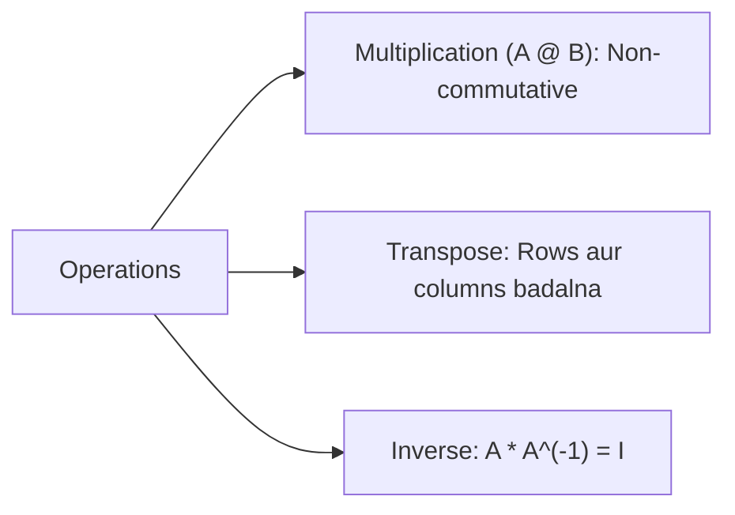

# Day 21 - Lecture 21.13: Matrices par Operations (Addition, Multiplication, Inverse) [Hinglish]

[](https://www.python.org/)
[](lecture_21_13.ipynb)
[](notes.pdf)

🌐 **Language / भाषा:** [English](README.md) | **हिंदी / Hinglish** | [⬅️ Lecture 21 Module Par Wapas Jayein](../README_HINGLISH.md)

---

## 1. Overview & Concept

Matrix Operations PyTorch, TensorFlow aur NumPy ke andar model execution ki core calculation hoti hain.



---

## 2. Ganitiya Sutra

### Matrix Multiplication:
$\mathbf{A} \in \mathbb{R}^{m \times k}$ aur $\mathbf{B} \in \mathbb{R}^{k \times n}$ ke liye $\mathbf{C} = \mathbf{A}\mathbf{B} \in \mathbb{R}^{m \times n}$:

$$
\boxed{\mathbf{A}\mathbf{B} \ne \mathbf{B}\mathbf{A} \quad \text{(Non-Commutative)}}
$$

### Transpose Rule:

$$
\boxed{(\mathbf{A}\mathbf{B})^T = \mathbf{B}^T \mathbf{A}^T}
$$

### Linear Regression Normal Equation:

$$
\boxed{\mathbf{w}^* = (\mathbf{X}^T \mathbf{X})^{-1} \mathbf{X}^T \mathbf{y}}
$$

---

## 3. Python Implementation

```python
import numpy as np

A = np.array([[1, 2], [3, 4]])
B = np.array([[5, 6], [7, 8]])

C = A @ B
A_inv = np.linalg.inv(A)

print("A @ B:\n", C)
print("A @ A_inv:\n", np.round(A @ A_inv))
```

---

## 4. Mukhya Batein (Key Takeaways) & Interview Points
- **Order Matters:** $\mathbf{A}\mathbf{B}$ aur $\mathbf{B}\mathbf{A}$ alag-alag hote hain.
- **Normal Equation:** Linear Regression ka closed-form solution $(\mathbf{X}^T \mathbf{X})^{-1} \mathbf{X}^T \mathbf{y}$ hota hai.
