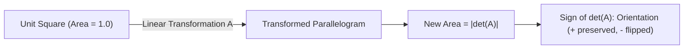

# Day 21 - Lecture 21.14: Determinants

[](https://www.python.org/)
[](lecture_21_14.ipynb)
[](notes.pdf)

🌐 **Language:** **English** | [हिंदी / Hinglish](README_HINGLISH.md) | [⬅️ Back to Lecture 21 Module](../README.md)

---

## 1. Overview & Geometric Area/Volume Distortion

The **Determinant** of a square matrix $\mathbf{A}$, denoted $\det(\mathbf{A})$ or $|\mathbf{A}|$, is a scalar value that encodes the **scaling factor of areas (in 2D) or volumes (in higher dimensions)** under the linear transformation represented by $\mathbf{A}$.



---

## 2. Mathematical Formalism

### 1. $2 \times 2$ Determinant:

$$
\boxed{\det \begin{bmatrix} a & b \\ c & d \end{bmatrix} = ad - bc}
$$

### 2. $3 \times 3$ Cofactor Expansion:

$$
\boxed{\det \begin{bmatrix} a & b & c \\ d & e & f \\ g & h & i \end{bmatrix} = a(ei - fh) - b(di - fg) + c(dh - eg)}
$$

### 3. Invertibility & Singularity Theorem:
A square matrix $\mathbf{A}$ is invertible if and only if its determinant is non-zero:

$$
\boxed{\mathbf{A}^{-1} \text{ exists} \iff \det(\mathbf{A}) \ne 0}
$$

If $\det(\mathbf{A}) = 0$, the transformation collapses space into a lower dimension (e.g., squashes a 2D plane into a 1D line), losing information irreversibly ($\mathbf{A}$ is **singular**).

### 4. Key Properties:
- $\det(\mathbf{A}\mathbf{B}) = \det(\mathbf{A}) \cdot \det(\mathbf{B})$
- $\det(\mathbf{A}^T) = \det(\mathbf{A})$
- $\det(\mathbf{A}^{-1}) = \frac{1}{\det(\mathbf{A})}$
- For orthogonal matrix $\mathbf{Q}$: $\det(\mathbf{Q}) = \pm 1$

---

## 3. Python Implementation

```python
import numpy as np

# Non-singular matrix
A = np.array([
    [4.0, 7.0],
    [2.0, 6.0]
])

# Singular matrix (col 2 is 2 * col 1)
B = np.array([
    [2.0, 4.0],
    [3.0, 6.0]
])

det_A = np.linalg.det(A)
det_B = np.linalg.det(B)

print(f"det(A): {det_A:.4f} (Exact: 4*6 - 7*2 = 24 - 14 = 10)")
print(f"det(B): {det_B:.4f} (Exact: 2*6 - 4*3 = 12 - 12 = 0)")
print(f"A is invertible: {not np.isclose(det_A, 0)}")
print(f"B is invertible: {not np.isclose(det_B, 0)}")
```

---

## 4. Key Takeaways & Interview Points
- **Geometric Meaning:** $|\det(\mathbf{A})|$ is the volume distortion factor. If $\det(\mathbf{A}) = 2.5$, the transformation scales any region's volume by $2.5\times$.
- **Normalizing Flows in Generative AI:** In Normalizing Flow generative models, change-of-variable density transformations require calculating the determinant of the Jacobian matrix $\det(\mathbf{J})$.
