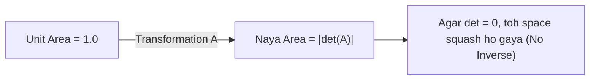

# Day 21 - Lecture 21.14: Determinants (Saarnik) [Hinglish]

[](https://www.python.org/)
[](lecture_21_14.ipynb)
[](notes.pdf)

🌐 **Language / भाषा:** [English](README.md) | **हिंदी / Hinglish** | [⬅️ Lecture 21 Module Par Wapas Jayein](../README_HINGLISH.md)

---

## 1. Overview & Geometric Arth

**Determinant** ($\det(\mathbf{A})$) ek scalar number hota hai jo yeh batata hai ki matrix transformation kisi area ya volume ko kitna **stretch ya shrink (scale)** karti hai.



---

## 2. Ganitiya Sutra

### $2 \times 2$ Formula:

$$
\boxed{\det \begin{bmatrix} a & b \\ c & d \end{bmatrix} = ad - bc}
$$

### Invertibility Test:
Matrix ka inverse tabhi nikal sakta hai jab uska determinant zero na ho:

$$
\boxed{\mathbf{A}^{-1} \text{ exists} \iff \det(\mathbf{A}) \ne 0}
$$

Agar $\det(\mathbf{A}) = 0$ ho, toh matrix **singular** hoti hai aur uska inverse possible nahi hota.

---

## 3. Python Implementation

```python
import numpy as np

A = np.array([[4, 7], [2, 6]])
det_val = np.linalg.det(A)

print(f"Determinant: {det_val:.2f} (Exact: 24 - 14 = 10)")
```

---

## 4. Mukhya Batein (Key Takeaways) & Interview Points
- **Area Scaling:** $\det = 3$ ka matlab transformation area ko 3 guna bada deti hai.
- **Singular Matrix:** $\det = 0$ hone par inverse exist nahi karta.
