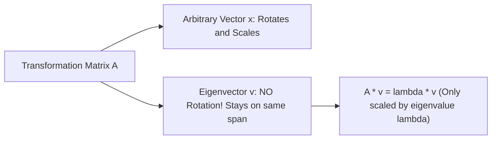

# Day 21 - Lecture 21.15: Eigenvalues & Eigenvectors

[](https://www.python.org/)
[](lecture_21_15.ipynb)
[](notes.pdf)

🌐 **Language:** **English** | [हिंदी / Hinglish](README_HINGLISH.md) | [⬅️ Back to Lecture 21 Module](../README.md)

---

## 1. Overview & Invariant Transformation Axes

When a square matrix $\mathbf{A}$ acts on an arbitrary vector $\mathbf{x}$, it typically changes both the vector's length and its direction. However, certain special vectors **only experience scaling without changing their directional orientation**. These invariant axes are the **Eigenvectors**, and the corresponding scaling factors are the **Eigenvalues**.



---

## 2. Mathematical Formalism

### 1. Fundamental Definition:
For square matrix $\mathbf{A} \in \mathbb{R}^{n \times n}$, a non-zero vector $\mathbf{v} \ne \mathbf{0}$ is an eigenvector with eigenvalue $\lambda \in \mathbb{C}$ if:

$$
\boxed{\mathbf{A} \mathbf{v} = \lambda \mathbf{v}}
$$

### 2. Characteristic Equation:
Rewriting the equation:

$$
\mathbf{A}\mathbf{v} - \lambda \mathbf{I}\mathbf{v} = \mathbf{0} \implies (\mathbf{A} - \lambda \mathbf{I})\mathbf{v} = \mathbf{0}
$$

For non-trivial solutions ($\mathbf{v} \ne \mathbf{0}$), the matrix $(\mathbf{A} - \lambda\mathbf{I})$ must be singular:

$$
\boxed{\det(\mathbf{A} - \lambda \mathbf{I}) = 0}
$$

Solving this $n$-th degree polynomial yields the $n$ eigenvalues $\lambda_1, \dots, \lambda_n$.

### 3. Spectral Decomposition (Symmetric Matrices):
For any real symmetric matrix $\mathbf{A} = \mathbf{A}^T$ (e.g., Covariance Matrix):
- All eigenvalues are strictly real: $\lambda_i \in \mathbb{R}$.
- Eigenvectors corresponding to distinct eigenvalues are strictly orthogonal: $\mathbf{v}_i \perp \mathbf{v}_j$.

$$
\boxed{\mathbf{A} = \mathbf{Q} \mathbf{\Lambda} \mathbf{Q}^T}
$$

where $\mathbf{Q}$ is an orthogonal matrix of eigenvectors and $\mathbf{\Lambda} = \text{diag}(\lambda_1, \dots, \lambda_n)$.

### 4. Principal Component Analysis (PCA) Connection:
In PCA, the principal component axes are the **eigenvectors of the covariance matrix $\mathbf{\Sigma}$**, sorted in descending order of their eigenvalues. The eigenvalue $\lambda_i$ represents the variance captured along component $i$.

---

## 3. Python Implementation

```python
import numpy as np

# Covariance matrix
A = np.array([
    [4.0, 2.0],
    [2.0, 3.0]
])

# Eigendecomposition
eigenvalues, eigenvectors = np.linalg.eigh(A)

# Sort in descending order
idx = np.argsort(eigenvalues)[::-1]
eigenvalues = eigenvalues[idx]
eigenvectors = eigenvectors[:, idx]

print("Eigenvalues (Variance along axes):\n", eigenvalues)
print("\nEigenvectors (Principal Axes):\n", eigenvectors)

# Verification: A @ v == lambda * v
v0 = eigenvectors[:, 0]
lambda0 = eigenvalues[0]

Av0 = np.dot(A, v0)
lambda_v0 = lambda0 * v0

print(f"\nA @ v0:        {Av0}")
print(f"lambda0 * v0:  {lambda_v0}")
print("A @ v == lambda * v:", np.allclose(Av0, lambda_v0))
```

---

## 4. Key Takeaways & Interview Points
- **Geometric Invariance:** Eigenvectors are the vectors whose directions do not rotate under the matrix transformation.
- **PCA Dimensionality Reduction:** The first principal component is the eigenvector with the largest eigenvalue, maximizing explained variance.
- **Trace and Determinant Identities:** $\sum \lambda_i = \text{Tr}(\mathbf{A})$ and $\prod \lambda_i = \det(\mathbf{A})$.
