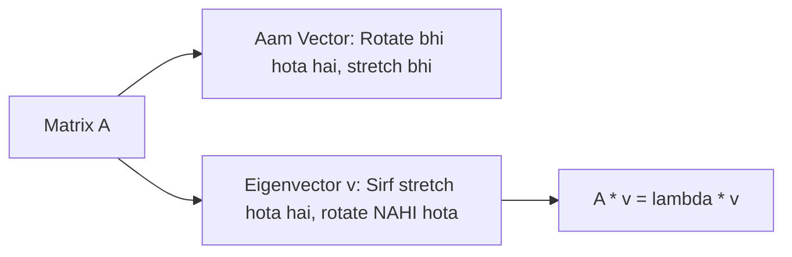

# Day 21 - Lecture 21.15: Eigenvectors aur Eigenvalues [Hinglish]

[](https://www.python.org/)
[](lecture_21_15.ipynb)
[](notes.pdf)

🌐 **Language / भाषा:** [English](README.md) | **हिंदी / Hinglish** | [⬅️ Lecture 21 Module Par Wapas Jayein](../README_HINGLISH.md)

---

## 1. Overview & Geometric Arth

Jab koi matrix kisi vector par act karti hai, toh aamtaur par vector ki lambai aur dishaa dono badal jati hain. Lekin kuch khaas vectors aise hote hain jinki **direction bilkul nahi badalti**, sirf lambai scale hoti hai. Inhi special vectors ko **Eigenvectors** aur unke scaling factor ko **Eigenvalues** kehte hain.



---

## 2. Ganitiya Sutra

$$
\boxed{\mathbf{A} \mathbf{v} = \lambda \mathbf{v}}
$$

Characteristic equation:

$$
\boxed{\det(\mathbf{A} - \lambda \mathbf{I}) = 0}
$$

### PCA (Principal Component Analysis) me Use:
Machine Learning me jab hum high-dimensional data ko reduce karte hain (PCA), toh covariance matrix ke **eigenvectors** hi naye principal axes bante hain, aur **eigenvalues** yeh batate hain ki har axis me kitna variance (information) store hai.

---

## 3. Python Implementation

```python
import numpy as np

A = np.array([[4.0, 2.0], [2.0, 3.0]])
evals, evecs = np.linalg.eigh(A)

print("Eigenvalues:", evals)
print("Eigenvectors:\n", evecs)

# Verification A*v == lambda*v
v0 = evecs[:, 0]
print("A @ v0:", A @ v0)
print("eval[0] * v0:", evals[0] * v0)
```

---

## 4. Mukhya Batein (Key Takeaways) & Interview Points
- **PCA ka Foundation:** PCA algorithm covariance matrix ke eigenvalues aur eigenvectors nikal kar hi kaam karta hai.
- **Trace aur Determinant:** Sabhi eigenvalues ka sum matrix ke trace ke barabar hota hai ($\sum \lambda_i = \text{Tr}(\mathbf{A})$), aur product determinant ke barabar hota hai ($\prod \lambda_i = \det(\mathbf{A})$).
