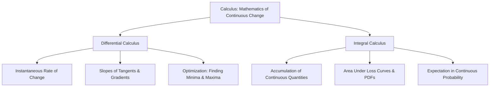

# 📉 Lecture 22.01: Introduction to Calculus for AI & Continuous Change

[](https://www.python.org/)
[](https://numpy.org/)
[](#)

🌐 **Language:** **English** | [हिंदी / Hinglish](README_HINGLISH.md) | [⬅️ Back to Lecture 22](../README.md)

---

## 📌 1. What is Calculus?

**Calculus** is the branch of mathematics that studies **continuous change**. While algebra deals with static relationships and discrete operations, calculus provides the formal machinery to model, measure, and control quantities that change dynamically over continuous intervals.

Calculus is divided into two fundamental branches:
1. **Differential Calculus:** Focuses on instantaneous rates of change, derivatives, and slopes of curves. It answers: *"How sensitive is an output quantity to tiny variations in its input?"*
2. **Integral Calculus:** Focuses on accumulation, total area under curves, and continuous summation. It answers: *"What total quantity accumulates when a rate varies continuously over time or space?"*



---

## 📐 2. The Core Role of Calculus in Machine Learning & AI

In Artificial Intelligence, every predictive model is fundamentally a parameterized function:

$$
\hat{y} = f_{\mathbf{w}}(\mathbf{x})
$$

where $\mathbf{x}$ is the input feature vector and $\mathbf{w}$ represents trainable parameters (weights and biases).

To train the model, we quantify prediction discrepancies using a scalar **Loss Function** (or Cost Function) $\mathcal{L}(\mathbf{w})$. Training is formulated as an optimization problem:

$$
\mathbf{w}^* = \mathop{\arg\min}_{\mathbf{w}} \mathcal{L}(\mathbf{w})
$$

### How Differential Calculus Drives Training:
- **Sensitivity Analysis:** The derivative $\frac{d\mathcal{L}}{dw_i}$ reveals exactly how the overall error increases or decreases when a single parameter $w_i$ is perturbed.
- **Gradient Vector:** In multidimensional parameter spaces, the gradient $\nabla \mathcal{L}(\mathbf{w})$ points in the direction of steepest error increase.
- **Gradient Descent:** Parameters are iteratively updated against the gradient direction:

$$
\mathbf{w}_{t+1} = \mathbf{w}_t - \eta \nabla \mathcal{L}(\mathbf{w}_t)
$$

where $\eta > 0$ is the learning rate.

---

## 📊 3. Discrete vs. Continuous Perspectives in Data Science

| Property | Discrete Mathematics (Algebra) | Continuous Mathematics (Calculus) |
| :--- | :--- | :--- |
| **Variable Nature** | Countable values ($n \in \mathbb{Z}$) | Uncountable intervals ($x \in \mathbb{R}$) |
| **Change Measurement** | Difference $\Delta y = y_2 - y_1$ | Infinitesimal limit $\lim_{\Delta x \to 0} \frac{\Delta y}{\Delta x}$ |
| **Rate of Change** | Average speed / secant slope | Instantaneous velocity / tangent slope |
| **Accumulation** | Discrete summation $\sum_{i=1}^N x_i$ | Continuous integration $\int_{a}^b f(x) \, dx$ |
| **AI Application** | Decision trees, graph search, hashing | Neural networks, backprop, diffusion models |

---

## 💻 4. Python Implementation: Discrete vs. Continuous Rate of Change

```python
import numpy as np
import matplotlib.pyplot as plt

# Define a smooth non-linear function: f(x) = x^2
def f(x):
    return x**2

# Choose point of interest x0
x0 = 3.0
analytical_slope = 2 * x0  # f'(x) = 2x => 6.0

# Demonstrate limit of average rate of change as delta_x -> 0
deltas = [1.0, 0.5, 0.1, 0.01, 0.0001]
print(f"Analytical Instantaneous Slope at x={x0}: {analytical_slope:.6f}\n")
print(f"{'Delta x':<12} | {'Average Slope':<15} | {'Approximation Error':<20}")
print("-" * 52)

for dx in deltas:
    avg_slope = (f(x0 + dx) - f(x0)) / dx
    error = abs(avg_slope - analytical_slope)
    print(f"{dx:<12.4f} | {avg_slope:<15.6f} | {error:<20.6e}")
```
