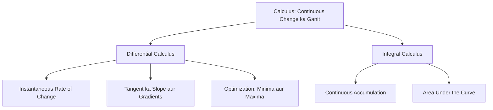

# 📉 Lecture 22.01: Calculus ka Parichay aur Continuous Change [Hinglish]

[](https://www.python.org/)
[](https://numpy.org/)
[](#)

🌐 **Language / भाषा:** [English](README.md) | **हिंदी / Hinglish** | [⬅️ Lecture 22 Par Wapas Jayein](../README_HINGLISH.md)

---

## 📌 1. Calculus Kya Hai?

**Calculus** mathematics ki woh branch hai jo **continuous change** (lagatar badlav) ka adhyayan karti hai.
Jahan algebra static aur discrete cheezon ko deal karta hai, wahi calculus humein yeh samajhne aur calculate karne ki taakat deta hai ki jab koi cheez continuously vary ho rahi ho toh kisi ek point par uske badlav ki gati (rate of change) kya hai.

Calculus ke do mukhya hisse hote hain:
1. **Differential Calculus:** Instantaneous rate of change aur curve ke slope ko study karta hai. Yeh batata hai ki: *"Agar input mein halka sa badlav kiya jaye, toh output kitna badlega?"*
2. **Integral Calculus:** Total accumulation aur curve ke neeche ke area ko measure karta hai.



---

## 📐 2. AI aur Machine Learning mein Calculus Kyu Zaroori Hai?

Machine Learning model fundamentally ek parameterized function hota hai:

$$
\hat{y} = f_{\mathbf{w}}(\mathbf{x})
$$

Jahan $\mathbf{x}$ input data hai aur $\mathbf{w}$ model ke weights hain.

Training ke dauran hum ek **Loss Function** $\mathcal{L}(\mathbf{w})$ define karte hain jo model ki galtiyon ko measure karta hai. Model training ka main goal hota hai loss ko kam se kam karna (minimize karna):

$$
\mathbf{w}^* = \mathop{\arg\min}_{\mathbf{w}} \mathcal{L}(\mathbf{w})
$$

### Calculus ka Role:
- **Derivative ($\frac{d\mathcal{L}}{dw}$):** Yeh batata hai ki weight badhane se loss badhega ya ghatega.
- **Gradient Descent:** Model ke weights ko loss ke opposite direction mein update kiya jata hai:

$$
\mathbf{w}_{t+1} = \mathbf{w}_t - \eta \nabla \mathcal{L}(\mathbf{w}_t)
$$

Agar calculus na ho, toh hum neural networks ke millions of parameters ko optimize nahi kar sakte.

---

## 💻 3. Python Code: Average Slope se Instantaneous Slope tak

```python
import numpy as np

def f(x):
    return x**2

x0 = 3.0
true_slope = 2 * x0  # 6.0

for dx in [1.0, 0.1, 0.01, 0.0001]:
    approx_slope = (f(x0 + dx) - f(x0)) / dx
    print(f"dx = {dx:<7} -> Approx Slope = {approx_slope:.6f}")
```
