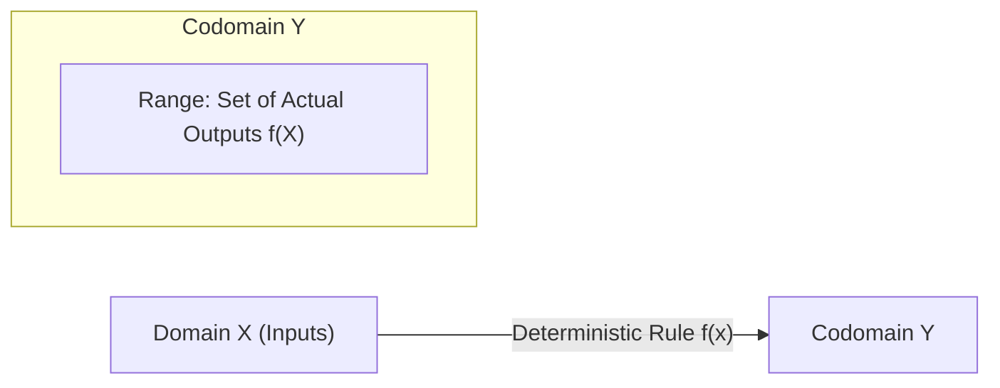

# 📈 Lecture 22.02: Mathematical Functions & Real-World Transformations

[](https://www.python.org/)
[](https://numpy.org/)
[](#)

🌐 **Language:** **English** | [हिंदी / Hinglish](README_HINGLISH.md) | [⬅️ Back to Lecture 22](../README.md)

---

## 📌 1. Mathematical Definition of a Function

A **Function** $f$ from set $X$ to set $Y$, denoted as:

$$
f: X \to Y
$$

is a deterministic mathematical rule that assigns **exactly one** element $y \in Y$ to each element $x \in X$.

### Key Structural Sets:
- **Domain ($\text{Dom}(f) = X$):** The set of all admissible input values for which $f(x)$ is defined.
- **Codomain ($Y$):** The target space into which all outputs are constrained.
- **Range ($\text{Ran}(f) \subseteq Y$):** The actual subset of outputs attained by the function:

$$
\text{Ran}(f) = \{y \in Y \mid \exists x \in X \text{ such that } f(x) = y\}
$$



---

## 📐 2. Essential Functional Families in AI & ML

### 1. Square Root & Power Functions ($y = \sqrt{x} = x^{1/2}$)
- **Domain:** $[0, \infty)$
- **Range:** $[0, \infty)$
- **AI Use:** Euclidean norm scaling $\|\mathbf{x}\|_2 = \sqrt{\sum x_i^2}$, Standard deviation $\sigma = \sqrt{\text{Var}(X)}$, and learning rate schedules.

### 2. Trigonometric Functions ($y = \sin(x), y = \cos(x)$)
- **Domain:** $(-\infty, \infty)$
- **Range:** $[-1, 1]$
- **AI Use:** Positional Encodings in Transformer architectures (Vaswani et al.), Periodic Fourier embeddings in NeRFs.

$$
PE_{(pos, 2i)} = \sin\left(\frac{pos}{10000^{2i/d_{\text{model}}}}\right), \qquad PE_{(pos, 2i+1)} = \cos\left(\frac{pos}{10000^{2i/d_{\text{model}}}}\right)
$$

### 3. Exponential & Logarithmic Functions ($y = e^x, y = \ln(x)$)
- **Exponential:** Maps $(-\infty, \infty) \to (0, \infty)$. Core component of Softmax probabilities:

$$
\text{Softmax}(z_i) = \frac{e^{z_i}}{\sum_j e^{z_j}}
$$

- **Logarithm:** Maps $(0, \infty) \to (-\infty, \infty)$. Core component of Cross-Entropy Loss:

$$
\mathcal{L}_{\text{CE}} = - \sum_i y_i \ln(\hat{y}_i)
$$

---

## 💻 3. Python Implementation: Graphing Core Function Families

```python
import numpy as np
import matplotlib.pyplot as plt

# Generate domains
x_pos = np.linspace(0, 100, 1000)
x_trig = np.linspace(-2 * np.pi, 2 * np.pi, 500)

fig, axes = plt.subplots(1, 2, figsize=(12, 5))

# Plot 1: Square root function y = sqrt(x)
axes[0].plot(x_pos, np.sqrt(x_pos), color='purple', lw=2, label=r'$y = \sqrt{x}$')
axes[0].set_title(r'Square Root Function $y = \sqrt{x}$', fontsize=12, fontweight='bold')
axes[0].set_xlabel('x')
axes[0].set_ylabel('y')
axes[0].grid(True, linestyle=':', alpha=0.6)
axes[0].legend()

# Plot 2: Sinusoidal function y = sin(x)
axes[1].plot(x_trig, np.sin(x_trig), color='blue', lw=2, label=r'$y = \sin(x)$')
axes[1].axhline(0, color='black', lw=1, ls='--')
axes[1].axvline(0, color='black', lw=1, ls='--')
axes[1].set_title(r'Trigonometric Function $y = \sin(x)$', fontsize=12, fontweight='bold')
axes[1].set_xlabel('x')
axes[1].set_ylabel('y')
axes[1].grid(True, linestyle=':', alpha=0.6)
axes[1].legend()

plt.tight_layout()
plt.show()
```
