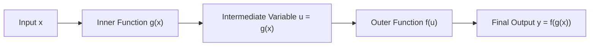

# 📈 Lecture 22.03: Composite Functions & Deep Neural Architectures

[](https://www.python.org/)
[](https://numpy.org/)
[](#)

🌐 **Language:** **English** | [हिंदी / Hinglish](README_HINGLISH.md) | [⬅️ Back to Lecture 22](../README.md)

---

## 📌 1. Definition of Composite Functions

Let $g: X \to U$ and $f: U \to Y$ be two mathematical functions. The **composite function** $(f \circ g)$, read as *"f composed with g"*, maps $X \to Y$ and is defined by:

$$
(f \circ g)(x) = f(g(x))
$$

### Structural Components:
- **Inner Function ($u = g(x)$):** Evaluated first on input $x$.
- **Outer Function ($y = f(u)$):** Takes the output of $g(x)$ as its input.



### Domain of Composite Functions:
The domain of $(f \circ g)$ consists of all $x \in \text{Dom}(g)$ such that $g(x) \in \text{Dom}(f)$:

$$
\text{Dom}(f \circ g) = \{x \in \text{Dom}(g) \mid g(x) \in \text{Dom}(f)\}
$$

---

## 🧠 2. Deep Neural Networks as Function Compositions

A Deep Neural Network with $L$ layers is mathematically **nothing other than a deep hierarchy of composite functions**.

For an input vector $\mathbf{x} \in \mathbb{R}^{d}$, layer $l$ performs an affine transformation followed by an activation function $\sigma$:

$$
\mathbf{h}^{(l)} = f_l(\mathbf{h}^{(l-1)}) = \sigma\left(W^{(l)} \mathbf{h}^{(l-1)} + \mathbf{b}^{(l)}\right)
$$

The overall network forward pass is:

$$
\hat{\mathbf{y}} = \left(f_L \circ f_{L-1} \circ \dots \circ f_2 \circ f_1\right)(\mathbf{x}) = f_L(f_{L-1}(\dots f_1(\mathbf{x})\dots))
$$


---

## 📐 3. Non-Commutativity of Composition

In general, function composition does **not** commute:

$$
(f \circ g)(x) \ne (g \circ f)(x)
$$

### Example:
Let $f(x) = x^2$ and $g(x) = x + 3$:
- $(f \circ g)(x) = f(x + 3) = (x + 3)^2 = x^2 + 6x + 9$
- $(g \circ f)(x) = g(x^2) = x^2 + 3$

Clearly, $x^2 + 6x + 9 \ne x^2 + 3$. This non-commutative property explains why layer ordering in deep neural networks fundamentally alters the model's expressive capacity.

---

## 💻 4. Python Implementation: Evaluating Composite Functions

```python
import numpy as np

# Define individual functions
def g(x):
    return 2 * x + 1  # Inner affine map

def f(u):
    return np.maximum(0, u)  # Outer ReLU activation

# Composite function (f o g)(x)
def f_composite_g(x):
    return f(g(x))

x_vals = np.array([-2.0, -1.0, -0.5, 0.0, 1.0, 2.0])
print(f"{'x':<8} | {'g(x) = 2x+1':<15} | {'f(g(x)) = ReLU(2x+1)':<20}")
print("-" * 50)
for x in x_vals:
    print(f"{x:<8.1f} | {g(x):<15.1f} | {f_composite_g(x):<20.1f}")
```
