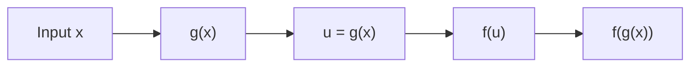

# 📈 Lecture 22.03: Composite Functions aur Deep Neural Architectures [Hinglish]

[](https://www.python.org/)
[](https://numpy.org/)
[](#)

🌐 **Language / भाषा:** [English](README.md) | **हिंदी / Hinglish** | [⬅️ Lecture 22 Par Wapas Jayein](../README_HINGLISH.md)

---

## 📌 1. Composite Function Kya Hota Hai?

Jab ek function ke output ko doosre function ka input banaya jata hai, toh usse **Composite Function** $(f \circ g)(x) = f(g(x))$ kehte hain.

- **Inner Function ($g(x)$):** Pehle execute hota hai.
- **Outer Function ($f(u)$):** $g(x)$ ke result par apply hota hai.



---

## 🧠 2. Deep Neural Networks as Composite Functions

Deep Neural Networks asal mein **nested composite functions ki chain** hote hain:

$$
\hat{\mathbf{y}} = f_L(f_{L-1}(\dots f_1(\mathbf{x})\dots))
$$

Har layer ek affine transformation ($W\mathbf{x} + \mathbf{b}$) aur non-linear activation $\sigma$ calculate karti hai. Backpropagation mein gradient nikaalne ke liye **Chain Rule** lagaya jata hai, jo composite functions ka hi derivative niyam hai.

---

## 💻 3. Python Code

```python
import numpy as np

def g(x): return 3 * x - 2
def f(u): return u**2

x = 4
print("g(x):", g(x))         # 10
print("f(g(x)):", f(g(x)))   # 100
```
