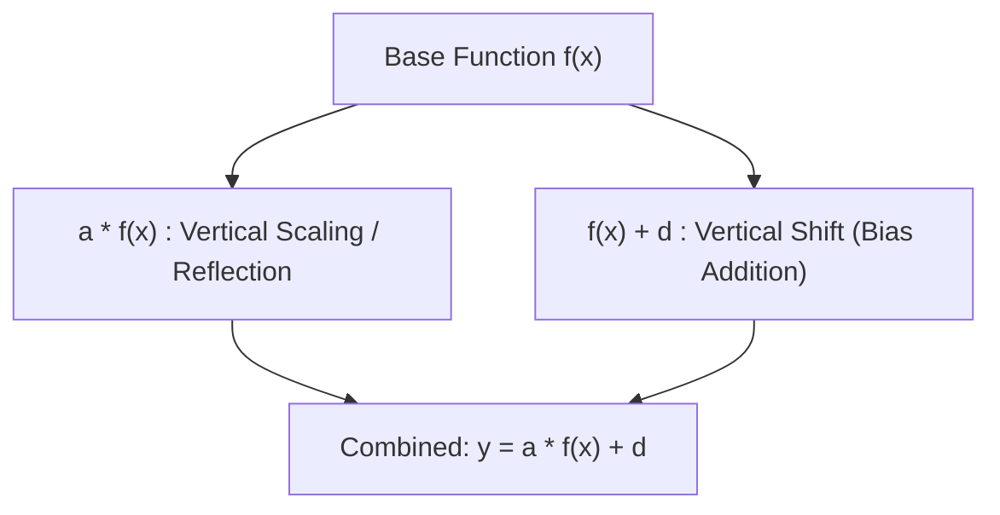

# 📈 Lecture 22.04: Operations on Functions: Scalar Multiplication & Addition

[](https://www.python.org/)
[](https://numpy.org/)
[](#)

🌐 **Language:** **English** | [हिंदी / Hinglish](README_HINGLISH.md) | [⬅️ Back to Lecture 22](../README.md)

---

## 📌 1. Algebraic Operations on Functions

Given two real-valued functions $f, g: \mathbb{R} \to \mathbb{R}$ and a scalar constant $c \in \mathbb{R}$:

1. **Function Addition:**
   $$
   (f + g)(x) = f(x) + g(x)
   $$
2. **Scalar Multiplication:**
   $$
   (c \cdot f)(x) = c \cdot f(x)
   $$
3. **Linear Combination:**
   $$
   h(x) = c_1 f(x) + c_2 g(x)
   $$

The domain of the sum $(f + g)$ is the intersection of their domains:

$$
\text{Dom}(f + g) = \text{Dom}(f) \cap \text{Dom}(g)
$$

---

## 📐 2. Geometric Effects: Vertical Transformations

When scalar operations are applied **outside** the function evaluation, they manipulate the graph vertically:

| Transformation | Equation | Geometric Effect |
| :--- | :--- | :--- |
| **Vertical Stretch** | $y = a \cdot f(x)$ with $a > 1$ | Graph stretched away from the x-axis by factor $a$. |
| **Vertical Compression** | $y = a \cdot f(x)$ with $0 < a < 1$ | Graph compressed toward the x-axis by factor $a$. |
| **Vertical Reflection** | $y = -f(x)$ | Graph reflected across the x-axis. |
| **Vertical Shift Up** | $y = f(x) + d$ with $d > 0$ | Graph shifted upward by $d$ units. |
| **Vertical Shift Down** | $y = f(x) - d$ with $d > 0$ | Graph shifted downward by $d$ units. |



---

## 🤖 3. Machine Learning Application: Weighted Neurons & Residual Connections

1. **Perceptron Output:** A single artificial neuron computes a linear combination of feature functions plus a vertical bias:

$$
y = \sum_{i=1}^m w_i x_i + b
$$

2. **Residual Networks (ResNets):** Residual skip connections perform function addition:

$$
\mathbf{h}_{l+1} = \mathbf{h}_l + \mathcal{F}(\mathbf{h}_l, W_l)
$$

Adding the identity function $\mathbf{h}_l$ prevents vanishing gradients and allows deep networks to train effectively.

---

## 💻 4. Python Implementation: Visualizing Vertical Transformations

```python
import numpy as np
import matplotlib.pyplot as plt

x = np.linspace(-3, 3, 300)
base = x**2

plt.figure(figsize=(9, 5))
plt.plot(x, base, 'k-', lw=2, label='Base: f(x) = x^2')
plt.plot(x, 2 * base, 'r--', lw=2, label='Vertical Stretch: 2 * f(x)')
plt.plot(x, 0.5 * base, 'g:', lw=2, label='Vertical Compression: 0.5 * f(x)')
plt.plot(x, base + 2, 'b-.', lw=2, label='Vertical Shift Up: f(x) + 2')
plt.plot(x, -base, 'm--', lw=2, label='Vertical Reflection: -f(x)')

plt.axhline(0, color='gray', lw=1)
plt.axvline(0, color='gray', lw=1)
plt.title('Vertical Transformations of Functions', fontsize=12, fontweight='bold')
plt.xlabel('x')
plt.ylabel('y')
plt.grid(True, linestyle=':', alpha=0.6)
plt.legend()
plt.ylim(-5, 10)
plt.show()
```
