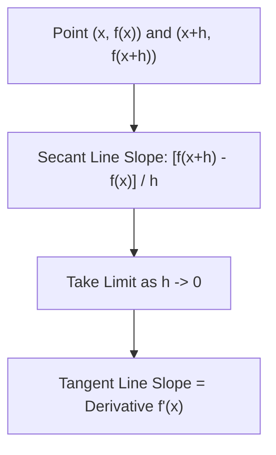

# 📈 Lecture 22.06: Differentiation & Instantaneous Rate of Change

[](https://www.python.org/)
[](https://numpy.org/)
[](#)

🌐 **Language:** **English** | [हिंदी / Hinglish](README_HINGLISH.md) | [⬅️ Back to Lecture 22](../README.md)

---

## 📌 1. From Secant Lines to the Tangent Line

Consider a continuous curve $y = f(x)$.

1. **Average Rate of Change (Secant Line):**
   The slope of the secant line connecting two points $(x, f(x))$ and $(x + h, f(x + h))$ is:

$$
m_{\text{secant}} = \frac{\Delta y}{\Delta h} = \frac{f(x + h) - f(x)}{h}
$$

2. **Instantaneous Rate of Change (Tangent Line):**
   As $h \to 0$, the secondary point slides along the curve toward the primary point. The secant line converges to the **tangent line**, and its slope gives the **derivative**:

$$
f'(x) = \frac{df}{dx} = \lim_{h \to 0} \frac{f(x + h) - f(x)}{h}
$$



---

## 📐 2. First-Principles Derivation Examples

### Example 1: Linear Function $f(x) = mx + c$

$$
f'(x) = \lim_{h \to 0} \frac{m(x + h) + c - (mx + c)}{h} = \lim_{h \to 0} \frac{mh}{h} = m
$$

The slope of a line is constant everywhere.

### Example 2: Quadratic Function $f(x) = x^2$

$$
f'(x) = \lim_{h \to 0} \frac{(x + h)^2 - x^2}{h} = \lim_{h \to 0} \frac{x^2 + 2xh + h^2 - x^2}{h} = \lim_{h \to 0} (2x + h) = 2x
$$

At $x = 3$, $f'(3) = 6$. The tangent slope varies as a function of position $x$.

---

## 🎯 3. Derivative as Local Linear Approximation

The derivative allows any non-linear differentiable curve to be approximated by a line in the infinitesimal neighborhood of $x_0$:

$$
f(x_0 + \Delta x) \approx f(x_0) + f'(x_0) \Delta x
$$

In machine learning, this first-order Taylor expansion explains how gradient updates predict loss decreases:

$$
\mathcal{L}(w - \eta f'(w)) \approx \mathcal{L}(w) - \eta [f'(w)]^2 < \mathcal{L}(w)
$$

---

## 💻 4. Python Implementation: Numerical Differentiation Convergence

```python
import numpy as np

def f(x):
    return x**3 - 4*x + 1

# Analytical derivative: f'(x) = 3x^2 - 4
def f_prime_exact(x):
    return 3*x**2 - 4

x0 = 2.0
exact = f_prime_exact(x0)  # 3*(4) - 4 = 8.0

print(f"Exact Analytical Derivative at x={x0}: {exact:.8f}\n")
print(f"{'Step Size h':<12} | {'Forward Diff':<16} | {'Central Diff':<16}")
print("-" * 48)

for h in [1e-1, 1e-2, 1e-4, 1e-6, 1e-8]:
    forward = (f(x0 + h) - f(x0)) / h
    central = (f(x0 + h) - f(x0 - h)) / (2 * h)
    print(f"{h:<12.1e} | {forward:<16.8f} | {central:<16.8f}")
```
