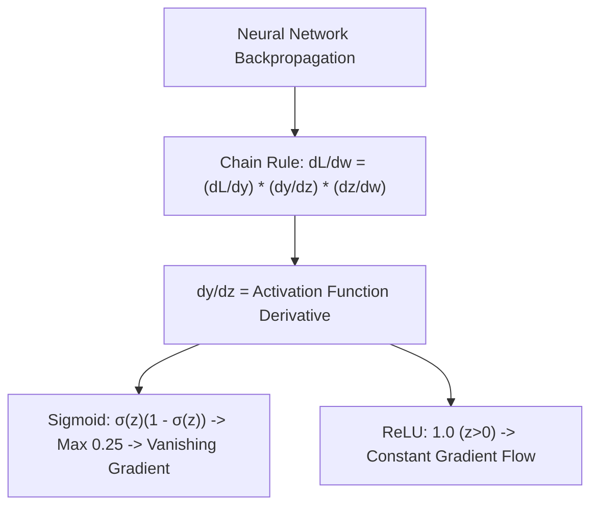

# 📈 Lecture 22.07: Differentiation Rules & Activation Function Derivatives

[](https://www.python.org/)
[](https://numpy.org/)
[](#)

🌐 **Language:** **English** | [हिंदी / Hinglish](README_HINGLISH.md) | [⬅️ Back to Lecture 22](../README.md)

---

## 📌 1. Fundamental Rules of Differentiation

| Rule Name | Mathematical Statement | Example |
| :--- | :--- | :--- |
| **Power Rule** | $\frac{d}{dx}[x^n] = n x^{n-1}$ | $\frac{d}{dx}[x^4] = 4x^3$ |
| **Constant Multiple Rule** | $\frac{d}{dx}[c \cdot f(x)] = c f'(x)$ | $\frac{d}{dx}[5x^3] = 15x^2$ |
| **Sum & Difference Rule** | $\frac{d}{dx}[f(x) \pm g(x)] = f'(x) \pm g'(x)$ | $\frac{d}{dx}[x^2 + 3x] = 2x + 3$ |
| **Product Rule** | $\frac{d}{dx}[f(x) g(x)] = f'(x) g(x) + f(x) g'(x)$ | $\frac{d}{dx}[x e^x] = e^x + x e^x$ |
| **Quotient Rule** | $\frac{d}{dx}\left[\frac{f(x)}{g(x)}\right] = \frac{f'(x)g(x) - f(x)g'(x)}{(g(x))^2}$ | $\frac{d}{dx}\left[\frac{x}{x+1}\right] = \frac{1}{(x+1)^2}$ |
| **Chain Rule** | $\frac{d}{dx}[f(g(x))] = f'(g(x)) \cdot g'(x)$ | $\frac{d}{dx}[(3x+1)^4] = 4(3x+1)^3 \cdot 3$ |

---

## 🧠 2. AI Activation Functions & Their Derivatives

### 1. Sigmoid Function: $\sigma(x) = \frac{1}{1 + e^{-x}}$
Using the Quotient / Chain Rule:

$$
\sigma'(x) = \frac{d}{dx}[(1 + e^{-x})^{-1}] = -(1 + e^{-x})^{-2} (-e^{-x}) = \frac{e^{-x}}{(1 + e^{-x})^2}
$$

Rewrite in self-referential form:

$$
\sigma'(x) = \frac{1}{1 + e^{-x}} \cdot \left(1 - \frac{1}{1 + e^{-x}}\right) = \sigma(x) (1 - \sigma(x))
$$

### 2. Hyperbolic Tangent: $\tanh(x) = \frac{e^x - e^{-x}}{e^x + e^{-x}}$

$$
\tanh'(x) = 1 - \tanh^2(x)
$$

### 3. Rectified Linear Unit (ReLU): $\text{ReLU}(x) = \max(0, x)$

$$
\text{ReLU}'(x) = \begin{cases} 1 & \text{if } x > 0 \\ 0 & \text{if } x < 0 \end{cases}
$$

(At $x = 0$, the subgradient convention sets the derivative to $0$ or $1$).



---

## 💻 3. Python Implementation: Verifying Activation Derivatives

```python
import numpy as np

def sigmoid(x):
    return 1 / (1 + np.exp(-x))

def sigmoid_deriv(x):
    s = sigmoid(x)
    return s * (1 - s)

x_test = np.array([-2.0, 0.0, 2.0])
print("Sigmoid values:     ", np.round(sigmoid(x_test), 4))
print("Sigmoid derivatives:", np.round(sigmoid_deriv(x_test), 4))
print("Max Sigmoid derivative occurs at x=0:", sigmoid_deriv(0.0))
```
