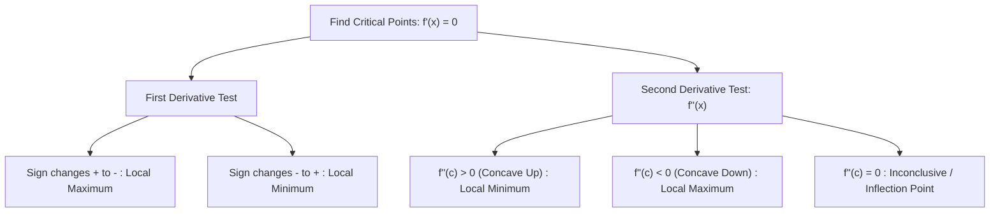

# 📈 Lecture 22.08: Finding Minima & Maxima

[](https://www.python.org/)
[](https://numpy.org/)
[](#)

🌐 **Language:** **English** | [हिंदी / Hinglish](README_HINGLISH.md) | [⬅️ Back to Lecture 22](../README.md)

---

## 📌 1. Critical Points & Local Extrema

A point $c \in \text{Dom}(f)$ is a **Critical Point** if:

$$
f'(c) = 0 \quad\text{or}\quad f'(c) \text{ is undefined}
$$

At points where $f'(c) = 0$, the tangent line is perfectly horizontal.



---

## 📐 2. The Second Derivative Test & Concavity

The second derivative $f''(x) = \frac{d^2 f}{dx^2}$ measures the **curvature** or rate of change of the slope:

1. **Local Minimum:**
   If $f'(c) = 0$ and $f''(c) > 0$, the function is concave up (bowl-shaped) at $c$, confirming a **local minimum**.
2. **Local Maximum:**
   If $f'(c) = 0$ and $f''(c) < 0$, the function is concave down (dome-shaped) at $c$, confirming a **local maximum**.
3. **Inflection Point:**
   A point where $f''(x) = 0$ and the concavity changes from concave up to concave down (or vice versa).

---

## 🤖 3. Gradient Descent Optimization Algorithm

In machine learning, finding roots of $\nabla \mathcal{L}(\mathbf{w}) = \mathbf{0}$ analytically is intractable for billions of parameters. Instead, we use **iterative numerical optimization**:

$$
w_{t+1} = w_t - \eta f'(w_t)
$$

- If $f'(w_t) > 0$ (positive slope), $w$ moves to the left (decreases).
- If $f'(w_t) < 0$ (negative slope), $w$ moves to the right (increases).
- At the minimum $f'(w^*) = 0$, updates naturally converge to zero.

---

## 💻 4. Python Implementation: Gradient Descent on a Quadratic Loss

```python
import numpy as np

# Loss function: L(w) = (w - 3)^2 + 4
def loss(w):
    return (w - 3)**2 + 4

def grad(w):
    return 2 * (w - 3)

w = 10.0  # Initial guess
lr = 0.1   # Learning rate
epochs = 20

print(f"{'Epoch':<6} | {'w':<12} | {'Grad dL/dw':<15} | {'Loss L(w)':<12}")
print("-" * 50)

for epoch in range(epochs):
    g = grad(w)
    l = loss(w)
    if epoch % 4 == 0 or epoch == epochs - 1:
        print(f"{epoch:<6} | {w:<12.5f} | {g:<15.5f} | {l:<12.5f}")
    w = w - lr * g

print(f"\nOptimal weight reached: w* = {w:.5f} (Exact: 3.00000)")
```
