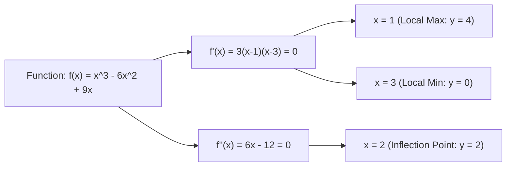

# 📈 Lecture 22.09: Calculus Optimization Practice Problem

[](https://www.python.org/)
[](https://numpy.org/)
[](#)

🌐 **Language:** **English** | [हिंदी / Hinglish](README_HINGLISH.md) | [⬅️ Back to Lecture 22](../README.md)

---

## 📌 1. The Practice Problem Statement

Find and classify all critical points and local extrema for the cubic polynomial function:

$$
f(x) = x^3 - 6x^2 + 9x
$$

---

## 📐 2. Step-by-Step Analytical Derivation

### Step 1: Compute the First Derivative
Applying the Power Rule:

$$
f'(x) = \frac{d}{dx}[x^3] - 6 \frac{d}{dx}[x^2] + 9 \frac{d}{dx}[x] = 3x^2 - 12x + 9
$$

---

### Step 2: Determine Critical Points
Set $f'(x) = 0$:

$$
3x^2 - 12x + 9 = 0
$$

Divide by $3$:

$$
x^2 - 4x + 3 = 0 \implies (x - 1)(x - 3) = 0
$$

Thus, we obtain two critical points:

$$
x_1 = 1, \qquad x_2 = 3
$$

---

### Step 3: Compute the Second Derivative
Differentiating $f'(x)$:

$$
f''(x) = \frac{d}{dx}[3x^2 - 12x + 9] = 6x - 12
$$

---

### Step 4: Classify Extrema via Second Derivative Test
1. **At critical point $x_1 = 1$:**
   $$
   f''(1) = 6(1) - 12 = -6 < 0
   $$
   Since $f''(1) < 0$, the function is concave down. Therefore, **$x = 1$ is a Local Maximum**.
   The maximum value is:
   $$
   f(1) = 1^3 - 6(1)^2 + 9(1) = 1 - 6 + 9 = 4
   $$
2. **At critical point $x_2 = 3$:**
   $$
   f''(3) = 6(3) - 12 = 18 - 12 = +6 > 0
   $$
   Since $f''(3) > 0$, the function is concave up. Therefore, **$x = 3$ is a Local Minimum**.
   The minimum value is:
   $$
   f(3) = 3^3 - 6(3)^2 + 9(3) = 27 - 54 + 27 = 0
   $$

---

### Step 5: Determine the Inflection Point
Set $f''(x) = 0$:

$$
6x - 12 = 0 \implies x_{\text{inf}} = 2
$$

At $x = 2$, $f(2) = 2^3 - 6(2)^2 + 9(2) = 8 - 24 + 18 = 2$.
The point $(2, 2)$ is the inflection point where concavity flips from concave down to concave up.



---

## 💻 3. Python Verification & Plotting

```python
import numpy as np
import matplotlib.pyplot as plt

x = np.linspace(-0.5, 4.5, 300)
f = x**3 - 6*x**2 + 9*x
df = 3*x**2 - 12*x + 9

plt.figure(figsize=(9, 5))
plt.plot(x, f, 'b-', lw=2.5, label=r'$f(x) = x^3 - 6x^2 + 9x$')
plt.plot(x, df, 'g--', lw=1.8, label=r"$f'(x) = 3x^2 - 12x + 9$")

# Mark Extrema
plt.scatter([1], [4], color='red', s=100, zorder=5, label='Local Maximum (1, 4)')
plt.scatter([3], [0], color='green', s=100, zorder=5, label='Local Minimum (3, 0)')
plt.scatter([2], [2], color='purple', s=100, marker='s', zorder=5, label='Inflection Point (2, 2)')

plt.axhline(0, color='black', lw=1)
plt.axvline(0, color='black', lw=1)
plt.title(r'Calculus Optimization: Extrema & Inflection Points', fontsize=12, fontweight='bold')
plt.xlabel('x')
plt.ylabel('y')
plt.grid(True, linestyle=':', alpha=0.6)
plt.legend()
plt.show()
```
