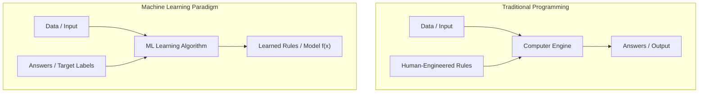

# 🤖 Lecture 23.01: Introduction to Machine Learning

[](https://www.python.org/)
[](https://scikit-learn.org/)
[](#)

🌐 **Language:** **English** | [हिंदी / Hinglish](README_HINGLISH.md) | [⬅️ Back to Lecture 23](../README.md)

---

## 📌 1. What is Machine Learning?

**Machine Learning (ML)** is a subfield of Artificial Intelligence that gives computer systems the ability to automatically learn patterns from data and improve their performance on a specific task without being explicitly programmed with deterministic hand-crafted rules.

### Historical & Formal Definitions:

> **Arthur Samuel (1959):**  
> *"Machine Learning is the field of study that gives computers the ability to learn without being explicitly programmed."*

> **Tom Mitchell (1997) — Formal Engineering Definition:**  
> *"A computer program is said to learn from experience $E$ with respect to some class of tasks $T$ and performance measure $P$, if its performance at tasks in $T$, as measured by $P$, improves with experience $E$."*

### Breakdown of the $(T, P, E)$ Framework:
1. **Task ($T$):** The operational problem to be solved (e.g., predicting insurance charges, filtering spam emails, recognizing handwritten digits).
2. **Performance Measure ($P$):** A quantitative metric evaluating how well the system performs the task (e.g., Mean Squared Error, Accuracy, $R^2$ Score).
3. **Experience ($E$):** Historical observation data supplied to the algorithm (e.g., tabular records, customer transactions, images).

---

## 🔄 2. Traditional Programming vs. Machine Learning Paradigm

In classical software engineering, humans write explicit logical conditions (if-else branching, loops). In Machine Learning, the system infers the mapping function $f: \mathbf{x} \mapsto y$ directly from inputs and outputs.



---

## 🚀 3. Why Machine Learning is Necessary

Traditional rule-based systems collapse when faced with:
1. **High Dimensionality:** In images with $1024 \times 1024 \times 3 \approx 3.14 \times 10^6$ pixels, manual if-else rules are humanly impossible to construct.
2. **Dynamic Non-Stationarity:** Spam patterns, fraud techniques, and user behavior mutate constantly; manual rules require endless updates.
3. **Hidden Latent Patterns:** In genomic sequencing and financial time series, patterns are governed by complex non-linear probabilistic interactions that cannot be deduced analytically.

---

## 💻 4. Python Demonstration: Rule-Based vs. Learned Model

```python
import numpy as np

# Synthetic feature: Square footage of house (in 1000 sq ft)
X = np.array([1.0, 1.5, 2.0, 2.5, 3.0])
# Target: House price (in $100k)
y = np.array([2.1, 2.9, 4.1, 5.0, 5.9])

# Traditional approach: Hard-coded human guess
def rule_based_predict(x):
    return 2.0 * x  # Static hand-crafted rule

# Machine Learning approach: Estimate optimal parameters w, b
# Using closed-form Least Squares formula: w = Cov(X,y)/Var(X)
X_mean, y_mean = np.mean(X), np.mean(y)
w_learned = np.sum((X - X_mean) * (y - y_mean)) / np.sum((X - X_mean)**2)
b_learned = y_mean - w_learned * X_mean

print(f"Human Hard-coded Rule: y = 2.0 * x")
print(f"Learned ML Model:      y = {w_learned:.3f} * x + {b_learned:.3f}")
```
