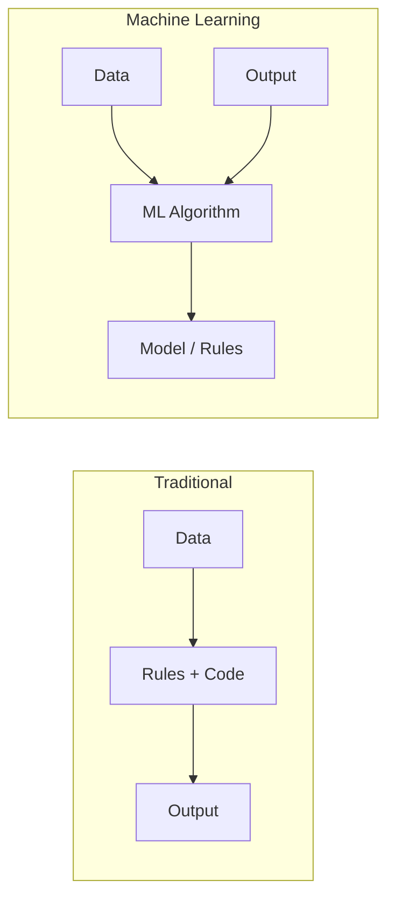

# 🤖 Lecture 23.01: Machine Learning ka Parichay [Hinglish]

[](https://www.python.org/)
[](https://scikit-learn.org/)
[](#)

🌐 **Language / भाषा:** [English](README.md) | **हिंदी / Hinglish** | [⬅️ Lecture 23 Par Wapas Jayein](../README_HINGLISH.md)

---

## 📌 1. Machine Learning Kya Hai?

**Machine Learning (ML)** Artificial Intelligence ka woh hissa hai jisme computer bina kisi explicit hard-coded rules ke data se khud pattern seekhta hai aur nayi situations par sahi predictions karta hai.

### Mukhya Paribhashayein:
- **Arthur Samuel (1959):** *"Machine Learning computer ko bina explicitly program kiye seekhne ki kshamta deti hai."*
- **Tom Mitchell (1997) ka (T, P, E) Framework:**
  - **Task ($T$):** Woh kaam jo karna hai (jaise: house price predict karna).
  - **Performance ($P$):** Model ki accuracy ya error metric.
  - **Experience ($E$):** Past training data.

---

## 🔄 2. Traditional Programming vs. Machine Learning

- **Traditional Programming:** Data + Rules $\longrightarrow$ Output (Hum rules khud likhte hain).
- **Machine Learning:** Data + Output $\longrightarrow$ Rules (Machine data aur output dekh kar khud rules dhoondhti hai).



---

## 💻 3. Python Code

```python
import numpy as np

# Data
X = np.array([1, 2, 3, 4, 5])
y = np.array([2, 4, 6, 8, 10])

# ML OLS Fit
w = np.cov(X, y)[0, 1] / np.var(X, ddof=1)
print(f"Learned slope: {w:.2f} (Expected: 2.00)")
```
