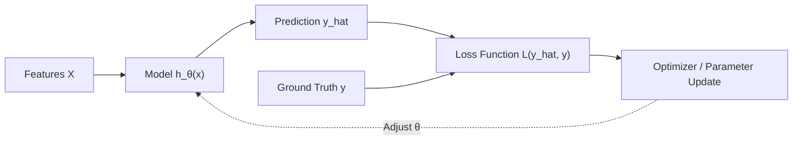

# 🎯 Lecture 23.02: Types of Machine Learning: Supervised Learning

[](https://www.python.org/)
[](https://scikit-learn.org/)
[](#)

🌐 **Language:** **English** | [हिंदी / Hinglish](README_HINGLISH.md) | [⬅️ Back to Lecture 23](../README.md)

---

## 📌 1. Mathematical Formulation of Supervised Learning

In **Supervised Learning**, the learning algorithm is provided with a training dataset of $N$ labeled examples:

$$
\mathcal{D}_{\text{train}} = \left\{ (\mathbf{x}_i, y_i) \right\}_{i=1}^N
$$

where:
- $\mathbf{x}_i \in \mathcal{X} \subseteq \mathbb{R}^d$ is a $d$-dimensional feature vector (independent variables).
- $y_i \in \mathcal{Y}$ is the true ground-truth target label (dependent variable).

### Objective of the Learner:
The goal is to learn a hypothesis function $h_{\boldsymbol{\theta}}: \mathcal{X} \to \mathcal{Y}$ parameterized by $\boldsymbol{\theta}$ such that it minimizes expected risk (loss) over unseen data:

$$
\boldsymbol{\theta}^* = \mathop{\arg\min}_{\boldsymbol{\theta}} \frac{1}{N} \sum_{i=1}^N \mathcal{L}\left(h_{\boldsymbol{\theta}}(\mathbf{x}_i), y_i\right)
$$



---

## 🏷️ 2. Core Components of Supervised Learning

| Component | Notation | Description | Example (Insurance Dataset) |
| :--- | :--- | :--- | :--- |
| **Instance / Sample** | $\mathbf{x}_i$ | A single observed entity | A specific insurance policyholder |
| **Feature Vector** | $[x_{i1}, \dots, x_{id}]^T$ | Numerical/categorical attributes | `[age, bmi, children, smoker]` |
| **Target Label** | $y_i$ | The true outcome being predicted | Annual healthcare `charges` |
| **Model Output** | $\hat{y}_i = h(\mathbf{x}_i)$ | The model's prediction | Estimated `charges` |
| **Supervisory Signal** | $e_i = y_i - \hat{y}_i$ | Discrepancy used for learning | Error used by Gradient Descent |

---

## 🔍 3. Types of Supervised Learning Tasks

Supervised Learning is partitioned based on the nature of the target space $\mathcal{Y}$:

1. **Regression ($\mathcal{Y} \subseteq \mathbb{R}$):** Target is continuous.
   - *Examples:* Predicting insurance charges, house prices, temperature.
2. **Binary Classification ($\mathcal{Y} \in \{0, 1\}$):** Target is binary.
   - *Examples:* Patient has disease (1) or healthy (0), Email is Spam (1) or Ham (0).
3. **Multi-Class Classification ($\mathcal{Y} \in \{1, \dots, K\}$):** Target has discrete multiple classes.
   - *Examples:* Classifying vehicle type (Car, Truck, Motorcycle, Bus).

---

## 💻 4. Python Implementation: Simulating the Supervised Learning Loop

```python
import numpy as np

# Training features and targets
X = np.array([[1.0], [2.0], [3.0], [4.0]])
y = np.array([2.5, 4.5, 6.5, 8.5])

# Initialize parameter w (hypothesis: y_hat = w * x)
w = 0.0
lr = 0.05

print(f"{'Epoch':<6} | {'Weight w':<10} | {'MSE Loss':<12} | {'Predictions y_hat'}")
print("-" * 55)

for epoch in range(15):
    # Forward pass
    y_pred = X.dot(w).squeeze()
    # Compute loss (MSE)
    loss = np.mean((y_pred - y)**2)
    # Compute gradient: dLoss/dw = 2/N * sum((y_pred - y) * x)
    grad = np.mean(2 * (y_pred - y) * X.squeeze())
    # Update weight
    w = w - lr * grad
    
    if epoch % 3 == 0 or epoch == 14:
        print(f"{epoch:<6} | {w:<10.4f} | {loss:<12.4f} | {np.round(y_pred, 2)}")
```
