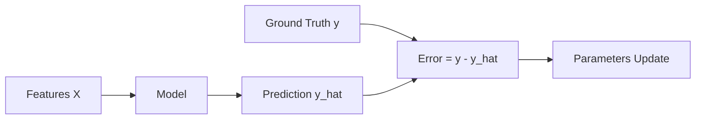

# 🎯 Lecture 23.02: Types of Machine Learning: Supervised Learning [Hinglish]

[](https://www.python.org/)
[](https://scikit-learn.org/)
[](#)

🌐 **Language / भाषा:** [English](README.md) | **हिंदी / Hinglish** | [⬅️ Lecture 23 Par Wapas Jayein](../README_HINGLISH.md)

---

## 📌 1. Supervised Learning Kya Hai?

**Supervised Learning** mein algorithm ko **labeled training data** diya jata hai:

$$
\mathcal{D} = \{(\mathbf{x}_i, y_i)\}
$$

Jahan $\mathbf{x}_i$ features hain (inputs) aur $y_i$ ground truth label hai (actual output).
Model ka kaam hota hai input aur output ke beech ka mapping function $f(\mathbf{x})$ dhoondhna taaki error minimize ho sake.



---

## 🏷️ 2. Mukhya Prakar

1. **Regression:** Jab target continuous number ho (jaise: Ghar ki keemat, insurance charges).
2. **Classification:** Jab target discrete classes ho (jaise: Spam vs Not Spam, Fraud vs Non-Fraud).

---

## 💻 3. Python Code

```python
import numpy as np

X = np.array([1, 2, 3, 4])
y = np.array([3, 6, 9, 12])

# Supervised mapping: y = 3 * x
w = 0.0
for _ in range(20):
    grad = np.mean(2 * (w * X - y) * X)
    w -= 0.05 * grad

print(f"Learned weight: {w:.2f}") # Output: 3.00
```
