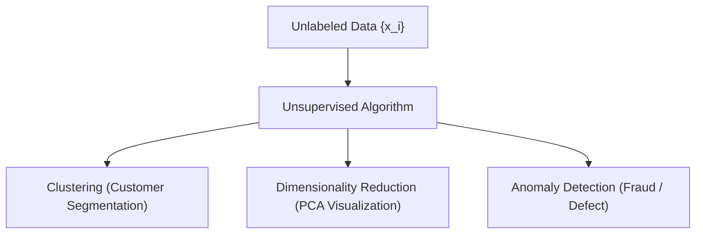
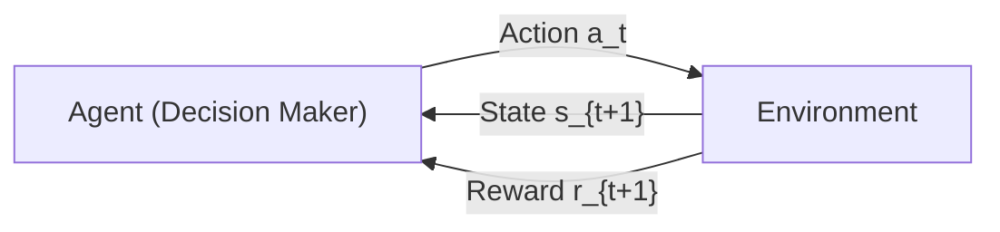

# 🌐 Lecture 23.03: Types of Machine Learning: Unsupervised & Reinforcement Learning

[](https://www.python.org/)
[](https://scikit-learn.org/)
[](#)

🌐 **Language:** **English** | [हिंदी / Hinglish](README_HINGLISH.md) | [⬅️ Back to Lecture 23](../README.md)

---

## 📌 1. Unsupervised Learning

In **Unsupervised Learning**, the algorithm receives an **unlabeled dataset**:

$$
\mathcal{D} = \left\{ \mathbf{x}_i \right\}_{i=1}^N
$$

There are **no target labels $y_i$** and no supervisory feedback. The goal is to discover latent geometric structure, underlying distributions, or compressed representations.

### Major Sub-Tasks in Unsupervised Learning:
1. **Clustering:** Partitioning data into $K$ cohesive clusters based on distance metrics.
   - *Algorithms:* K-Means, DBSCAN, Hierarchical Clustering.
2. **Dimensionality Reduction:** Compressing $d$-dimensional feature spaces to $k \ll d$ latent dimensions while preserving variance.
   - *Algorithms:* Principal Component Analysis (PCA, Lecture 21), t-SNE, UMAP.
3. **Anomaly & Outlier Detection:** Identifying rare observations that deviate significantly from the baseline distribution.
4. **Density Estimation:** Modeling the probability density $p(\mathbf{x})$ (e.g., Gaussian Mixture Models).



---

## 🎮 2. Reinforcement Learning (RL)

In **Reinforcement Learning**, an autonomous **Agent** learns to make sequential decisions by interacting with a dynamic **Environment** using trial-and-error to maximize cumulative scalar **Rewards**.

Reinforcement Learning is formulated mathematically as a **Markov Decision Process (MDP)** tuple $(S, A, P, R, \gamma)$:
- **State ($s_t \in S$):** Current situation of the agent.
- **Action ($a_t \in A$):** Decision chosen by the agent.
- **Reward ($r_{t+1} \in \mathbb{R}$):** Feedback signal evaluating the action.
- **Policy ($\pi(a|s)$):** The agent's decision-making strategy.



---

## 📊 3. Master Comparison of Machine Learning Paradigms

| Feature | Supervised Learning | Unsupervised Learning | Reinforcement Learning |
| :--- | :--- | :--- | :--- |
| **Data Nature** | Labeled $\{(\mathbf{x}_i, y_i)\}$ | Unlabeled $\{\mathbf{x}_i\}$ | Environment States & Actions |
| **Feedback Signal** | Direct Ground Truth $y_i$ | None (Self-organization) | Delayed Scalar Reward $r_t$ |
| **Objective** | Predict output for new inputs | Discover latent patterns/clusters | Maximize cumulative reward $\sum \gamma^t r_t$ |
| **Key Algorithms** | Linear/Logistic Reg, SVM, Trees | K-Means, PCA, GMM, Autoencoders | Q-Learning, PPO, Deep Q-Networks (DQN) |
| **Typical Use-Cases** | Price prediction, spam detection | Customer segmentation, compression | Robotics, Chess/Go, Autonomous driving |

---

## 💻 4. Python Demonstration: K-Means Clustering vs. Labeled Data

```python
import numpy as np
import matplotlib.pyplot as plt
from sklearn.cluster import KMeans

# Generate synthetic 2D points with 2 natural clusters
np.random.seed(42)
c1 = np.random.randn(50, 2) + np.array([2, 2])
c2 = np.random.randn(50, 2) + np.array([-2, -2])
X_unlabeled = np.vstack([c1, c2])

# Apply unsupervised K-Means clustering (no labels given!)
kmeans = KMeans(n_clusters=2, random_state=42, n_init=10)
cluster_labels = kmeans.fit_predict(X_unlabeled)

print("K-Means discovered centroids:\n", np.round(kmeans.cluster_centers_, 3))
```
