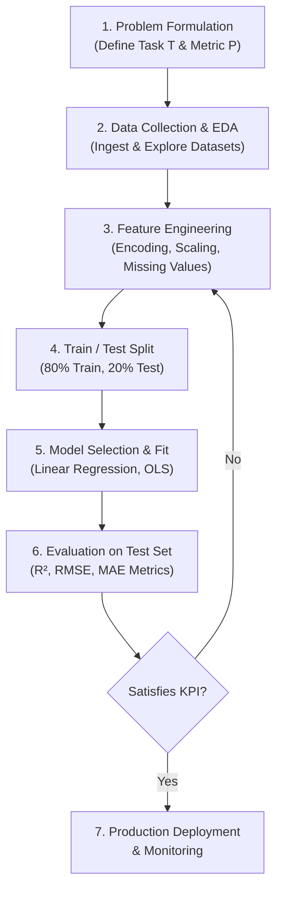

# 🔄 Lecture 23.04: Supervised Machine Learning Workflow & Components

[](https://www.python.org/)
[](https://scikit-learn.org/)
[](#)

🌐 **Language:** **English** | [हिंदी / Hinglish](README_HINGLISH.md) | [⬅️ Back to Lecture 23](../README.md)

---

## 📌 1. The Production Machine Learning Lifecycle

Developing a supervised machine learning system requires a disciplined, iterative 7-stage engineering pipeline:



---

## ⚖️ 2. The Train / Test Split Principle

To measure how well a model **generalizes** to unseen future data, we must never evaluate a model solely on the data it was trained on. Evaluating on training data leads to overly optimistic performance estimates.

### Standard Partition:
- **Training Set (typically 80%):** Used exclusively by the optimizer to adjust parameters $\boldsymbol{\theta}$.
- **Testing Set (typically 20%):** Kept strictly isolated during training; used as an unbiased benchmark of real-world generalization.

$$
\mathcal{D} = \mathcal{D}_{\text{train}} \cup \mathcal{D}_{\text{test}}, \qquad \mathcal{D}_{\text{train}} \cap \mathcal{D}_{\text{test}} = \emptyset
$$

---

## 📉 3. Overfitting vs. Underfitting (The Generalization Challenge)

| Condition | Underfitting (High Bias) | Balanced (Optimal Model) | Overfitting (High Variance) |
| :--- | :--- | :--- | :--- |
| **Model Complexity** | Too simple (e.g. line on quadratic data) | Matches true data distribution | Overly complex (e.g. degree 15 polynomial) |
| **Training Error** | High | Low | Extremely Low / Zero |
| **Test Error** | High | Low | High (Fails to generalize) |
| **Remedy** | Increase model capacity, add features | Maintain current architecture | Regularization, more data, feature selection |

---

## 💻 4. Python Implementation: Scikit-Learn Train/Test Splitting

```python
import pandas as pd
from sklearn.model_selection import train_test_split

# Simulated dataset
df = pd.DataFrame({
    'age': [19, 18, 28, 33, 32, 31, 46, 54],
    'bmi': [27.9, 33.7, 33.0, 22.7, 28.8, 25.7, 33.4, 30.8],
    'smoker': [1, 0, 0, 0, 0, 0, 0, 1],
    'charges': [16884, 1725, 4449, 21984, 3866, 3756, 8240, 24476]
})

# Separate features X and target y
X = df.drop(columns=['charges'])
y = df['charges']

# Execute train/test split with deterministic random seed
X_train, X_test, y_train, y_test = train_test_split(
    X, y, test_size=0.25, random_state=42
)

print(f"Total instances:    {len(df)}")
print(f"Training instances: {len(X_train)}")
print(f"Testing instances:  {len(X_test)}")
```
