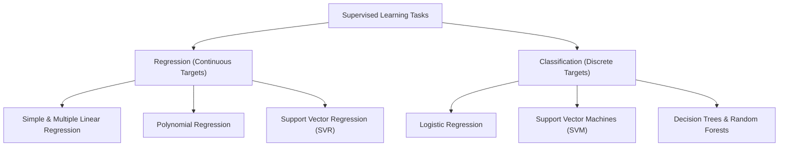

# ⚖️ Lecture 23.05: Regression vs. Classification Tasks

[](https://www.python.org/)
[](https://scikit-learn.org/)
[](#)

🌐 **Language:** **English** | [हिंदी / Hinglish](README_HINGLISH.md) | [⬅️ Back to Lecture 23](../README.md)

---

## 📌 1. The Core Distinction

Supervised Machine Learning is fundamentally partitioned based on whether the target variable $y$ is **continuous** or **discrete**:

| Dimension | Regression | Classification |
| :--- | :--- | :--- |
| **Target Space $\mathcal{Y}$** | Continuous real values $\mathcal{Y} \subseteq \mathbb{R}$ | Discrete categorical set $\mathcal{Y} \in \{C_1, \dots, C_k\}$ |
| **Model Output** | Scalar quantity (e.g. $\$14,250.50$) | Class label or posterior probability $P(y=c \mid \mathbf{x})$ |
| **Geometric Goal** | Fit a continuous surface / trend line | Find a separating decision boundary |
| **Typical Loss Functions** | Mean Squared Error (MSE), MAE, Huber Loss | Binary Cross-Entropy / Log Loss, Multi-Class Cross-Entropy |
| **Primary Evaluation** | $R^2$ Score, RMSE, MAE | Accuracy, Precision, Recall, F1-Score, ROC-AUC |
| **Example Problems** | Insurance charges, house prices, GDP forecast | Cancer detection (Malignant/Benign), Spam detection |



---

## 📐 2. Mathematical Comparison

### Regression:
Given feature vector $\mathbf{x}$, predict continuous scalar $\hat{y}$:

$$
\hat{y} = \mathbf{w}^T \mathbf{x} + b
$$

Cost function penalizes geometric distance between true value and prediction:

$$
J(\mathbf{w}, b) = \frac{1}{2m} \sum_{i=1}^m (y^{(i)} - \hat{y}^{(i)})^2
$$

### Classification:
Given feature vector $\mathbf{x}$, estimate probability that sample belongs to class $1$:

$$
P(y = 1 \mid \mathbf{x}) = \sigma(\mathbf{w}^T \mathbf{x} + b) = \frac{1}{1 + e^{-(\mathbf{w}^T \mathbf{x} + b)}}
$$

Cost function penalizes logarithmic probability divergence:

$$
J(\mathbf{w}, b) = -\frac{1}{m} \sum_{i=1}^m \left[ y^{(i)} \ln(\hat{y}^{(i)}) + (1 - y^{(i)}) \ln(1 - \hat{y}^{(i)}) \right]
$$

---

## 💻 3. Python Demonstration: Visualizing Both Paradigms

```python
import numpy as np
import matplotlib.pyplot as plt

np.random.seed(42)
X = np.linspace(1, 10, 40)

# Regression: Continuous target with Gaussian noise
y_reg = 2.5 * X + 3.0 + np.random.randn(40) * 2.0

# Classification: Binary thresholded target (0 or 1)
y_clf = np.where(y_reg > 15.0, 1, 0)

fig, (ax1, ax2) = plt.subplots(1, 2, figsize=(13, 5))

# Regression plot
ax1.scatter(X, y_reg, color='blue', label='Data points y in R')
ax1.plot(X, 2.5*X + 3.0, 'r-', lw=2, label='Fitted Line y_hat')
ax1.set_title('Regression: Continuous Output', fontsize=12, fontweight='bold')
ax1.set_xlabel('Feature x')
ax1.set_ylabel('Continuous Target y')
ax1.grid(True, linestyle=':')
ax1.legend()

# Classification plot
ax2.scatter(X[y_clf == 0], y_clf[y_clf == 0], color='green', s=60, label='Class 0')
ax2.scatter(X[y_clf == 1], y_clf[y_clf == 1], color='red', s=60, label='Class 1')
ax2.axvline(4.8, color='black', linestyle='--', lw=2, label='Decision Boundary')
ax2.set_title('Classification: Discrete Binary Output', fontsize=12, fontweight='bold')
ax2.set_xlabel('Feature x')
ax2.set_ylabel('Class Label y in {0, 1}')
ax2.set_yticks([0, 1])
ax2.grid(True, linestyle=':')
ax2.legend()

plt.tight_layout()
plt.show()
```
